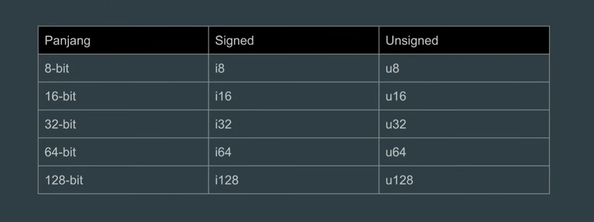
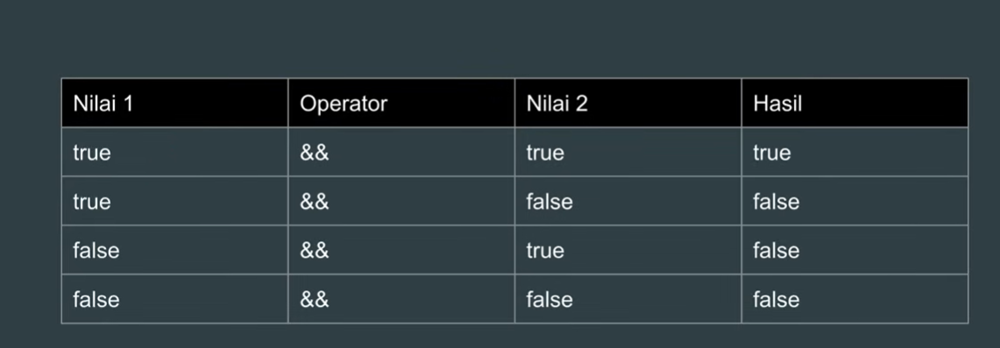
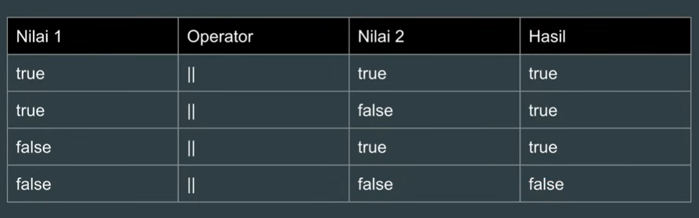
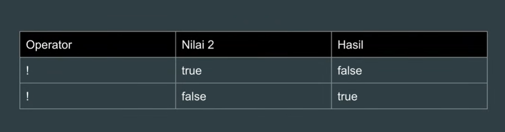

[🇬🇧 English](README.md) | 🇮🇩 Bahasa Indonesia

---

# Ini adalah repositori saya untuk belajar pemrograman Rust, ditulis pada 29 Juli 2026, oleh GhenAyari.

--- 
## Cara menulis "Hello world di Rust"
<br>

```rust
fn main(){
    println!("Hello, world!");
}
```

--- 

## Pengantar singkat tentang cargo di rust

Cargo adalah package manager bawaan dan build system di Rust. contoh penggunaan cargo di bawah ini:

1. untuk membuat proyek baru di rust, kita bisa menulis

```text
cargo akan membuat struktur proyek seperti di bawah ini

belajar_rust/


├── Cargo.toml


└── src/


└── main.rs
```

2. bisa menjalankan program seperti yang ditunjukkan di bawah ini

```text
cargo test
```

3. Menjalankan pengujian (test)

```
cargo test
```

4. jika ingin mengukur performa atau merilis sebuah aplikasi

```text
cargo build --release
```

atau

```
cargo run --release
```

Menurut saya, kebanyakan programmer rust menghabiskan 90% waktu mereka menggunakan cargo run, lalu beralih ke
cargo build --release setelah aplikasi siap untuk pengembangan
atau pengujian performa

---

## Unit test
Di Rust, satu proyek hanya bisa menggunakan satu fungsi main. saya akan menggunakan metode alternatif yaitu "unit test"
unit test adalah kode yang secara khusus didedikasikan untuk pengujian.

```rust
#[test]
fn testing(){
    println!("nama saya ghen dan saat ini saya sedang belajar rust");
}
```

ini adalah outputnya, 


kita bisa menjalankannya dengan "cargo test nama_fungsi_test -- --exact" atau bisa juga "cargo test nama_fungsi_test -- --nocapture" <br>
tapi, langkah pertama hanya akan menjalankan semua unit test dan tidak akan menampilkan outputnya. jadi saya sering menggunakan langkah kedua

---

## Variabel
Variabel digunakan untuk menyimpan nilai data, untuk membuat atau mendeklarasikan variabel di rust, kita bisa menggunakan kata kunci "let".
contoh penggunaannya ditunjukkan di bawah ini:

```rust
#[test]
fn variable(){
    let my_name = "Ghendida";
    println!("Hallo {} ", my_name);
}
```

dan ouputnya

```terminaloutput
PS D:\Rust\basic_rust> cargo test variable -- --nocapture
   Compiling basic_rust v0.1.0 (D:\Rust\basic_rust)
    Finished `test` profile [unoptimized + debuginfo] target(s) in 0.48s                                                                                                           
     Running unittests src\main.rs (target\debug\deps\basic_rust-4923d86b01c67cd4.exe)

running 1 test
Hallo Ghendida 
test variable ... ok
```

---

Di Rust, kita tidak bisa mengubah variabel yang sudah diberi nilai, yang biasanya disebut immutable (tidak dapat diubah). Namun,
Rust memungkinkan kita untuk membuat variabel yang bisa diubah, yang dikenal sebagai mutable (dapat diubah), dan kata kuncinya adalah let mut.

```rust
#[test]
fn variable_mutable(){
    let mut age_in_2025: i8 = 18;
    println!("umur saya di tahun 2025 adalah {} ", age_in_2025);

    age_in_2025 = 19;
    println!("umur saya di tahun 2026 adalah {} ", age_in_2025);
}
```

output

```terminaloutput
PS D:\Rust\basic_rust> cargo test variable_mutable -- --nocapture
Compiling basic_rust v0.1.0 (D:\Rust\basic_rust)
Finished `test` profile [unoptimized + debuginfo] target(s) in 0.49s                                                                                                           
Running unittests src\main.rs (target\debug\deps\basic_rust-4923d86b01c67cd4.exe)

running 1 test
umur saya di tahun 2025 adalah 18
umur saya di tahun 2026 adalah 19
test variable_mutable ... ok
```

---

Rust adalah bahasa dengan tipe data statis (statically typed), artinya setiap kali Anda membuat variabel dengan tipe data tertentu,
tipenya tidak bisa diubah ke tipe lain.
Berbeda dengan JavaScript dan PHP, hal ini tidak dimungkinkan, contohnya, mengubah dari string menjadi integer tidak akan berhasil di Rust

```rust
#[test]
fn static_type(){
    let mut my_github = "GhenAyari";
    println!("Github saya adalah {}", my_github);

    my_github = 1;
    println!("Github saya adalah {}", my_github);
}
```

dan outputnya akan menjadi

```terminaloutput
PS D:\Rust\basic_rust> cargo test static_type -- --nocapture
   Compiling basic_rust v0.1.0 (D:\Rust\basic_rust)
error[E0308]: mismatched types                                                                                                                                                     
  --> src\main.rs:30:17
   |
27 |     let mut my_github = "GhenAyari";
   |                         ----------- expected due to this value
...
30 |     my_github = 1;
   |                 ^ expected `&str`, found integer

For more information about this error, try `rustc --explain E0308`.                                                                                                                
error: could not compile `basic_rust` (bin "basic_rust" test) due to 1 previous error
```

---

Di Rust, kita bisa membuat variabel dengan nama yang sama, tetapi saat kita melakukannya, variabel sebelumnya akan tertutupi,
atau yang disebut sebagai shadowing. praktik ini tidak ideal, tetapi masih diperbolehkan di Rust

```rust
#[test]
fn shadowing(){
    let name = "Ghendida";
    println!("Hallo {} ", name);

    let name = 10;
    println!("sekarang tanggal {} ", name);

    let name = 2026;
    println!("ini adalah tahun {} ", name);
}
```

dan outputnya akan menjadi

```terminaloutput
PS D:\Rust\basic_rust> cargo test shadowing -- --nocapture
   Compiling basic_rust v0.1.0 (D:\Rust\basic_rust)
    Finished `test` profile [unoptimized + debuginfo] target(s) in 0.52s                                                                                                           
     Running unittests src\main.rs (target\debug\deps\basic_rust-4923d86b01c67cd4.exe)

running 1 test
Hallo Ghendida 
sekarang tanggal 10 
ini adalah tahun 2026 
test shadowing ... ok
```

Seperti yang terlihat di atas, jika kita membuat variabel dengan nama yang sama tetapi memiliki nilai dan tipe data yang berbeda,
variabel sebelumnya akan terkena shadowing dan menjadi tidak dapat diakses lagi

Setiap variabel di Rust memiliki tipe data, yang dikelompokkan menjadi dua jenis: skalar (scalar) dan gabungan (compound). Tipe skalar mewakili sebuah nilai tunggal, contohnya: string, integer, float,
boolean, dan char. Sementara itu, tipe gabungan mewakili lebih dari satu nilai, yaitu tuple dan array

---

Di Rust, saat membuat variabel, tidak perlu menyebutkan tipe datanya secara eksplisit karena Rust akan
secara otomatis mengenali tipe data yang digunakan. Namun, tetap memungkinkan jika Anda ingin menyebutkan tipe data secara eksplisit saat membuat variabel dengan kata kunci titik dua (:)

contoh variabel eksplisit

```rust
#[test]
fn explicit_variable(){
    let age: i8 = 19;
    println!("Umur saya {} ", age);

    let weight: f32 = 51.5;
    println!("berat badan saya {} ", weight);
}
```

output

```terminaloutput
PS D:\Rust\basic_rust> cargo test explicit_variable -- --nocapture
   Compiling basic_rust v0.1.0 (D:\Rust\basic_rust)
    Finished `test` profile [unoptimized + debuginfo] target(s) in 0.48s                                                                                                           
     Running unittests src\main.rs (target\debug\deps\basic_rust-4923d86b01c67cd4.exe)

running 1 test
Umur saya 19 
berat badan saya 51.5 
test explicit_variable ... ok
```

---

Berikut ini adalah tipe data integer dan float




Jika Anda membuat variabel secara implisit atau tidak menyebutkan tipe datanya,
Rust akan otomatis memberikan tipe i32 untuk integer dan f64 untuk bilangan desimal

---

Konversi tipe data

Rust bisa melakukan konversi tipe data dari tipe yang lebih kecil ke tipe yang lebih besar, dan sebaliknya. Namun, ada hal yang perlu diingat: mengonversi tipe data yang lebih besar ke yang lebih kecil dapat menyebabkan integer overflow.
Contohnya, mencoba mengubah nilai 100.000 dari tipe i32 ke i8 akan memicu integer overflow


pertama, contoh dari tipe yang lebih kecil ke tipe yang lebih besar

```rust
#[test]
fn conversion(){
    let a: i8 = 19;
    println!("angka saya {} ", a);

    let b: i16 = a as i16;
    println!("angkanya adalah {} ", b);

    let c : i32 = a as i32;
    println!("angka saya {} ", c); 
}
```

outputnya akan menjadi

```terminaloutput
PS D:\Rust\basic_rust> cargo test conversion -- --nocapture       
Compiling basic_rust v0.1.0 (D:\Rust\basic_rust)
Finished `test` profile [unoptimized + debuginfo] target(s) in 0.51s                                                                                                           
Running unittests src\main.rs (target\debug\deps\basic_rust-4923d86b01c67cd4.exe)

running 1 test
angka saya 19
angkanya adalah 19
angka saya 19
test conversion ... ok

test result: ok. 1 passed; 0 failed; 0 ignored; 0 measured; 5 filtered out; finished in 0.00s
```

dan contoh untuk tipe data besar ke kecil

```rust
#[test]
fn conversion_to_large(){
    let a: i64 = 1000000;
    println!("angka {} ", a);

    let b: i8 = a as i8;
    println!("angka {} ", b);

}
```

outputnya menjadi

```terminaloutput
PS D:\Rust\basic_rust> cargo test conversion_to_large -- --nocapture
   Compiling basic_rust v0.1.0 (D:\Rust\basic_rust)
    Finished `test` profile [unoptimized + debuginfo] target(s) in 0.42s                                                                                                           
     Running unittests src\main.rs (target\debug\deps\basic_rust-4923d86b01c67cd4.exe)

running 1 test
angka 1000000 
angka 64 
test conversion_to_large ... ok
```

---

## Operator

Operator numerik
di bawah ini adalah contoh penggunaan operator numerik untuk studi kasus rumus luas trapesium

```rust
#[test]
fn operators_numeric(){

    let height = 3.0;

    let a = 5.0;

    let b = 8.0;

    let l = 0.5;

    let result = l * (a + b) * height;

    println!("hasil = {}, ({} + {}), X {}, = {} ", l, a, b, height, result);

}
```

dan hasilnya adalah

```terminaloutput
PS D:\Rust\basic_rust> cargo test operators_numeric -- --nocapture
   Compiling basic_rust v0.1.0 (D:\Rust\basic_rust)
    Finished `test` profile [unoptimized + debuginfo] target(s) in 0.50s                                                                                                           
     Running unittests src\main.rs (target\debug\deps\basic_rust-4923d86b01c67cd4.exe)

running 1 test
hasil = 0.5, (5 + 8), X 3, = 19.5 
test operators_numeric ... ok
```

---

### operator perbandingan


Operator perbandingan adalah simbol khusus dalam pemrograman yang digunakan untuk membandingkan dua nilai atau ekspresi guna menentukan hubungan di antara keduanya. Hasil dari operasi perbandingan
selalu berupa nilai boolean—baik itu True atau False—yang biasanya digunakan dalam struktur pengambilan keputusan seperti if statement atau perulangan (loop)

contoh untuk operator perbandingan
```rust
#[test]
fn comparison_operators(){

    let a = 15 > 10;
    let b = 10 >= 10;
    let c = 15 < 10;
    let d = 10 == 10;

    println!("apakah angka 15 lebih besar dari 10? = {}", a);
    println!("apakah angka 10 lebih besar atau sama dengan 10? = {}", b);
    println!("apakah angka 15 kurang dari 10? = {}", c);
    println!("apakah angka 10 sama dengan 10? = {}", d);

}
```

dan outputnya 

```terminaloutput
PS D:\Rust\basic_rust> cargo test comparison_operators -- --nocapture
   Compiling basic_rust v0.1.0 (D:\Rust\basic_rust)
    Finished `test` profile [unoptimized + debuginfo] target(s) in 0.57s                                                                                                           
     Running unittests src\main.rs (target\debug\deps\basic_rust-4923d86b01c67cd4.exe)

running 1 test
apakah angka 15 lebih besar dari 10? = true
apakah angka 10 lebih besar atau sama dengan 10? = true
apakah angka 15 kurang dari 10? = false
apakah angka 10 sama dengan 10? = true
test comparison_operators ... ok
```

### operator boolean

Operator boolean adalah operator logika yang digunakan untuk membandingkan nilai atau mengevaluasi ekspresi, menghasilkan nilai akhir berupa benar (true) atau salah (false).
Operator ini berfungsi sebagai dasar pengendalian alur program dan penyaringan informasi dalam berbagai sistem digital

contoh untuk operator boolean








contoh kode di bawah

```rust
#[test]
fn boolean_operators(){

    let age = 20;
    let height = 170;

    let category = 18 <= age;
    let height_check = 165 <= height; // diubah namanya agar tidak tumpang tindih (shadowing) secara membingungkan

    let result = category && height_check;

    println!("apakah dia pria dewasa? {}", result);

}
```

dan outputnya:
```terminaloutput
PS D:\Rust\basic_rust> cargo test boolean_operators -- --nocapture
Compiling basic_rust v0.1.0 (D:\Rust\basic_rust)
Finished `test` profile [unoptimized + debuginfo] target(s) in 0.55s                                                                                                           
Running unittests src\main.rs (target\debug\deps\basic_rust-4923d86b01c67cd4.exe)

running 1 test
apakah dia pria dewasa? true
test boolean_operators ... ok
```

## Tipe data gabungan (Compound data type)

Tuple, sebuah Tuple adalah tipe data yang mengelompokkan sekumpulan tipe data.
Jumlah elemen dalam sebuah tuple bersifat final dan tidak bisa diubah, dikurangi, atau ditambah. untuk membuat tuple, kita bisa menggunakan tanda kurung biasa ()

contoh untuk tuple
```rust
#[test]
fn tuple(){
    let a: (i32, f64, &str) = (500, 6.4, "Hello");

    println!("Ini adalah tuple = {:?} ", a);

    let tuple1 = a.0;
    let tuple2 = a.1;
    let tuple3 = a.2;

    println!("{}, {}, {} ", tuple1, tuple2, tuple3);

    // atau kita juga bisa melakukan Destructuring tuple
    let (x, y, _) = a; // gunakan _ jika tidak ingin menggunakan salah satunya
    println!("Menggunakan destructuring tuple = {}, {}", x, y);
}
```

dan outputnya

```terminaloutput
dan outputnya:

S D:\Rust\basic_rust> cargo test tuple -- --nocapture
   Compiling basic_rust v0.1.0 (D:\Rust\basic_rust)
    Finished `test` profile [unoptimized + debuginfo] target(s) in 0.52s                                                                                                           
     Running unittests src\main.rs (target\debug\deps\basic_rust-4923d86b01c67cd4.exe)

running 1 test
Ini adalah tuple = (500, 6.4, "Hello") 
500, 6.4, Hello 
500, 6.4
test tuple ... ok
```

### Tuple yang bisa diubah (Mutable Tuple)

Secara teknis, kita masih bisa memodifikasi isi dari tuple dengan menjadikannya mutable tuple. Anda hanya perlu menambahkan kata kunci mut

contoh untuk mutable tuple
```rust
#[test]
fn mutable_tuple(){
    let mut about_me: (&str, i8, &str) = ("Ghen", 19, "Universitas Mulawarman");

    let (a, b, c) = about_me;

    println!("{}, {}, {}", a, b, c);

    about_me.0 = "Ghendida";
    about_me.1 = 20;
    about_me.2 = "Dari universitas mulawarman";

    println!("{:?}", about_me);

}
```

dan outputnya

```terminaloutput
PS D:\Rust\basic_rust> cargo test mutable_tuple -- --nocapture 
   Compiling basic_rust v0.1.0 (D:\Rust\basic_rust)
    Finished `test` profile [unoptimized + debuginfo] target(s) in 0.48s                                                                                                           
     Running unittests src\main.rs (target\debug\deps\basic_rust-4923d86b01c67cd4.exe)

running 1 test
Ghen, 19, Universitas Mulawarman
("Ghendida", 20, "Dari universitas mulawarman")
test mutable_tuple ... ok
```

### Array

Array adalah tipe data yang menampung sekumpulan data seperti halnya tuple. Perbedaannya adalah dalam
array Anda hanya bisa menggunakan satu tipe data, berbeda dengan tuple yang bisa menggunakan banyak tipe data. Untuk membuat array, gunakan kurung siku []

contoh kodenya di bawah ini:

```rust
#[test]
fn array(){

    let array_list: [i8; 3] = [10, 20, 30];
    println!("berikut adalah beberapa array = {:?}", array_list);

    let a = array_list[0];
    let b = array_list[1];
    let c = array_list[2];

    println!("{}, {}, {}", a, b, c);


}
```

hasil output di bawah ini:

```terminaloutput
PS D:\Rust\basic_rust> cargo test array -- --nocapture
Compiling basic_rust v0.1.0 (D:\Rust\basic_rust)
Finished `test` profile [unoptimized + debuginfo] target(s) in 0.58s                                                                                                           
Running unittests src\main.rs (target\debug\deps\basic_rust-4923d86b01c67cd4.exe)

running 1 test
berikut adalah beberapa array = [10, 20, 30]
10, 20, 30
test array ... ok
```

### Array yang bisa diubah (Mutable Array)

kita bisa mengubah isi array dengan menggunakan kata kunci "mut".
contoh kodenya di bawah ini

```rust
#[test]
fn mutable_array(){

    let mut array_can_change: [&str; 3] = ["Ramli", "Ruger", "Razi"];

    println!("{:?}", array_can_change);

    array_can_change[0] = "Rizal";
    array_can_change[1] = "Raditya";
    array_can_change[2] = "Roslan";

    println!("{}, {}, {}" , array_can_change[0], array_can_change[1], array_can_change[2]);

}
```

hasil output di bawah ini

```terminaloutput
PS D:\Rust\basic_rust> cargo test mutable_array -- --nocapture
Compiling basic_rust v0.1.0 (D:\Rust\basic_rust)
Finished `test` profile [unoptimized + debuginfo] target(s) in 0.59s                                                                                                           
Running unittests src\main.rs (target\debug\deps\basic_rust-4923d86b01c67cd4.exe)

running 1 test
["Ramli", "Ruger", "Razi"]
Rizal, Raditya, Roslan
test mutable_array ... ok
```

### array dua dimensi


kita bisa membuat array di dalam array, yang biasa disebut sebagai array dua dimensi

contoh kodenya di bawah ini

```rust
#[test]
fn two_dimensional_arrays(){

    let array: [[i32; 3];3] = [
        [13, 16, 6],
        [10, 08, 09],
        [10, 06, 30]

    ];

    println!("{:?}", array);

    println!("{}", array[1][1]);
    println!("{}", array[0][1]);
    println!("{}", array[0][0]);

}
```

dan outputnya 

```terminaloutput
PS D:\Rust\basic_rust> cargo test two_dimensional_array -- --nocapture
Compiling basic_rust v0.1.0 (D:\Rust\basic_rust)
Finished `test` profile [unoptimized + debuginfo] target(s) in 0.45s                                                                                                           
Running unittests src\main.rs (target\debug\deps\basic_rust-4923d86b01c67cd4.exe)

running 1 test
[[13, 16, 6], [10, 8, 9], [10, 6, 30]]
8
16
13
test two_dimensional_arrays ... ok
```

---

## Constant (Konstanta)

Konstanta adalah variabel yang tidak dapat diubah (immutable) yang menggunakan kata kunci const. Perbedaan antara const dan let adalah konstanta tidak dapat dibuat menjadi mutable (bisa diubah), dan Anda harus secara eksplisit menyatakan tipe data saat membuat sebuah konstanta.

contoh kode di bawah ini:

```rust
const MAXIMUM: i16 = 37;
#[test]
fn const_variable() {
const MINIMUM: i16 = 33;
println!("Gunakan variabel konstan {}", MINIMUM);

    println!("Kita dapat menggunakan variabel di luar scope {}", MAXIMUM);
}
```

output-nya akan seperti di bawah ini:

```terminaloutput
PS D:\Rust\basic_rust> cargo test const_variable -- --nocapture       
Compiling basic_rust v0.1.0 (D:\Rust\basic_rust)
Finished `test` profile [unoptimized + debuginfo] target(s) in 0.52s                                                                                                           
Running unittests src\main.rs (target\debug\deps\basic_rust-4923d86b01c67cd4.exe)

running 1 test
Gunakan variabel konstan 33
Kita dapat menggunakan variabel di luar scope 37
test const_variable ... ok
```

---

## Scope (Cakupan Variabel)

Scope variabel mendefinisikan area di mana sebuah variabel dapat digunakan. Sebuah variabel dapat digunakan di dalam scope tempat variabel tersebut berada serta di scope bagian dalamnya (inner scope), tetapi tidak dapat digunakan di scope luarnya (outer scope).

contoh kode di bawah ini:

const UNIV_NAME: &str = "Mulawarman University"; // Variabel ini dapat digunakan karena berada di scope terluar sehingga fungsi apa pun dapat mengaksesnya

```rust
#[test]
fn scope() {
// variabel name belum bisa digunakan di sini
let name = "Ghendida"; // variabel name bisa digunakan mulai dari sini
println!("nama dia adalah {}", name);

    { // inner scope (scope bagian dalam)
        println!("nama tengahnya adalah Gantari dan nama depannya {}", name);
        let age: i8 = 19;
        println!("dia berumur {} tahun dan dari {} ", age, UNIV_NAME);
    }

    // println!("{}", age); // error karena berada di outer scope (scope luar)
}
```

output di bawah ini:

```terminaloutput
PS D:\Rust\basic_rust> cargo test scope -- --nocapture
Compiling basic_rust v0.1.0 (D:\Rust\basic_rust)
Finished `test` profile [unoptimized + debuginfo] target(s) in 0.57s                                                                                                           
Running unittests src\main.rs (target\debug\deps\basic_rust-4923d86b01c67cd4.exe)

running 1 test
nama dia adalah Ghendida
nama tengahnya adalah Gantari dan nama depannya Ghendida
dia berumur 19 tahun dan dari Mulawarman University
test scope ... ok
```

## Management Memory (Manajemen Memori)
Manajemen memori mengatur bagaimana sebuah program menggunakan RAM komputer saat berjalan. 
Setiap data membutuhkan ruang, dan tantangan terbesarnya adalah: Kapan memori harus dibebaskan agar bisa digunakan kembali?

Perbandingan Pendekatan Bahasa Pemrograman:

### Perbandingan Pendekatan Bahasa Pemrograman:

| Manual (C / C++) | Garbage Collector (Java / Go / Python) | Compiler (Rust) |
| :--- | :--- | :--- |
| 💡 Kontrol penuh | 💡 Developer terima beres | 💡 Otomatis & Aman |
| ⚠️ Rentan Bug | ⚠️ Performa turun (Jeda/Lag) | ⚠️ Waktu *Compile* cenderung lama |
| ⚠️ *Memory Leak* | ⚠️ Konsumsi RAM tinggi | ✨ Tanpa *Runtime Garbage Collector* |

C / C++ (Manual): Programmer meminta dan membebaskan memori sendiri. Cepat, tetapi jika lupa akan memicu Memory Leak, dan jika salah hapus akan memicu Crash.

Java / Go / Python (Garbage Collector): Ada sistem otomatis di latar belakang yang mencari memori tidak terpakai lalu menghapusnya. Mudah bagi developer, tetapi memicu jeda performa (runtime pause).

Rust (Ownership System): Memori dikelola otomatis oleh compiler menggunakan aturan ketat saat kode dikompilasi (compile-time). Memberikan kecepatan setara C++ namun seaman Java.

Struktur RAM: Stack vs Heap

<b>Saat program Rust berjalan, data dialokasikan ke salah satu dari dua struktur memori berikut:</b>

```text
RAM
 ├── 📦 STACK (Cepat, Berurutan, Ukuran Tetap)
 └── 🏢 HEAP  (Fleksibel, Dinamis, Ukuran Berubah)
```

### Stack

Bekerja dengan prinsip LIFO (Last In, First Out) 
seperti tumpukan piring. Hanya data yang ukurannya sudah pasti saat compile yang boleh masuk ke sini.

Bekerja dengan prinsip LIFO (Last In, First Out) seperti tumpukan piring. Hanya data yang ukurannya sudah pasti saat compile yang boleh masuk ke sini.

```
Plaintext
▲ ATAS (Akses Cepat)
│ ┌──────────────────┐
│ │ Tumpukan Data 3  │ ◄── Masuk terakhir / Keluar pertama (Push/Pop)
│ ├──────────────────┤
│ │ Tumpukan Data 2  │
│ ├──────────────────┤
│ │ Tumpukan Data 1  │
│ └──────────────────┘
▼ BAWAH
```
Tipe Data Stack: i32, f64, bool, char, Array bertipe [T; N].

### Heap
Bekerja seperti gudang besar. 
Sistem operasi mencari ruang kosong yang cukup besar, mengalokasikannya, dan mengembalikan sebuah alamat memori (pointer).

```
🏢 HEAP AREA (Alokasi Dinamis & Acak)
 ┌──────────────────────────────────────────────┐
 │  ┌─────────────────┐    ┌─────────────────┐  │
 │  │ Data String "A" │    │  Data Vector    │  │
 │  └─────────────────┘    └─────────────────┘  │
 │            ┌──────────────────────┐          │
 │            │ Data HashMap         │          │
 │            └──────────────────────┘          │
 └──────────────────────────────────────────────┘
```
Tipe Data Heap: String, Vec<T>, HashMap<K, V>.

### Perbandingan Stack vs Heap

| Fitur | Stack | Heap |
| :--- | :--- | :--- |
| **Kecepatan** | ⚡ Sangat Cepat | 🐢 Lebih Lambat |
| **Alokasi** | Otomatis oleh CPU | Dinamis oleh OS |
| **Ukuran Memori** | Terbatas (Kecil) | Sangat Besar (Fleksibel) |
| **Struktur** | Berurutan & Teratur | Acak & Fleksibel |
| **Biaya Akses** | Rendah | Lebih Tinggi (Butuh Pointer) |

### Anatomi Alokasi String di Memori

Tipe data dinamis seperti String memanfaatkan kedua memori ini secara bersamaan:

```
STACK (Menyimpan Metadata)             HEAP (Menyimpan Teks Asli)
 ┌────────────────────────┐              ┌────────────────────────┐
 │ ptr (Pointer Alamat)   │─────────────►│ 'G' 'h' 'e' 'n'        │
 ├────────────────────────┤              └────────────────────────┘
 │ len (Panjang Data) = 4 │
 ├────────────────────────┤
 │ cap (Kapasitas)   = 4 │
 └────────────────────────┘
```

### Simulasi Jalannya Memori: function_a() & function_b()

Mari kita bedah visualisasi memori dari kode pengujian Rust berikut:

```
#[test]
fn memory_management() {
    function_a(); // 1. Membuat stack frame A -> Selesai -> Hancur
    function_b(); // 2. Membuat stack frame B -> Selesai -> Hancur
}

fn function_a(){
    let age = 19; // Masuk STACK (4 byte)
    let year_of_birth = String::from("2006"); // Metadata di STACK, teks di HEAP
    let year: i32 = year_of_birth.parse().unwrap(); // Masuk STACK

    println!("Ghen berumur {} tahun dan lahir di tahun {}", age, year);
    // ── Scope Berakhir ──
    // age & year dihapus dari STACK.
    // year_of_birth dihapus dari STACK, dan teks "2006" di HEAP otomatis dibebaskan!
}

fn function_b(){
    let name = String::from("Ghendida"); // Metadata di STACK, teks di HEAP
    let entry_year = 2024; // Masuk STACK

    println!("Nama saya {} dan masuk universitas tahun {}", name, entry_year);
    // ── Scope Berakhir ──
    // Data di STACK dibersihkan, memori "Ghendida" di HEAP otomatis dihapus.
}
```

```
STACK (Frame function_a)                 HEAP
 ┌────────────────────────┐              ┌────────────────────────┐
 │ age = 19               │              │ "2006"                 │
 ├────────────────────────┤              │ ▲                      │
 │ year = 2006            │              │ │                      │
 ├────────────────────────┤              │ │                      │
 │ year_of_birth (String) │              │ │                      │
 │  - Pointer ────────────┼──────────────┘                        │
 │  - Length = 4          │                                       │
 │  - Capacity = 4        │                                       │
 └────────────────────────┘                                       │
```

Kondisi Memori Setelah function_a() Selesai (Masuk ke function_b()):

```
STACK (Frame function_b)                 HEAP
 ┌────────────────────────┐              ┌────────────────────────┐
 │ entry_year = 2024      │              │ "Ghendida"             │
 ├────────────────────────┤              │ ▲                      │
 │ name (String)          │              │ │                      │
 │  - Pointer ────────────┼──────────────┘                      │
 │  - Length = 8          │              💡 Memori "2006" di Heap  │
 │  - Capacity = 8        │                 sudah dibersihkan!    │
 └────────────────────────┘                                       │
```

## &str vs String
Rust membedakan string menjadi dua tipe utama demi keamanan dan efisiensi memori.

&str (String Slice): Ukuran tetap, disimpan di Stack (atau menunjuk ke memori Read-Only). Ia tidak memiliki data tersebut, hanya meminjam.

String: Ukuran dinamis, dialokasikan di Heap. Bisa ditambah atau dikurangi teksnya (growable).

Contoh Penggunaan &str (Tanpa Alokasi Heap):

```rust
#[test]
fn string_slice() {
    let mut name: &str = "  Ghendida  "; // Pointer + Len disimpan di STACK
    println!("{}", name);

    // .trim() tidak membuat String baru, ia hanya menggeser pointer di STACK
    let delete_space: &str = name.trim(); 
    println!("{}", delete_space);
}
```

Contoh Penggunaan String (Menggunakan Heap):

```rust
#[test]
fn string_not_fixed_size() {
    let name: String = String::from("ghendida ayari");
    println!("{}\n", name.to_lowercase());

    let mut list_name = (String::new(), String::from("satrio"), String::from("Rusman"));
    list_name.0.push_str("Akmal"); // ✅ Bisa ditambah teks baru karena dialokasikan di Heap

    println!("\n{}, {}, {} ", 
        list_name.0.to_uppercase(), 
        list_name.1.to_uppercase(), 
        list_name.2.replace("Rusman", "Ramli").to_uppercase()
    );
}
```

## Konsep Dasar Ownership (Kepemilikan)
Ownership adalah terobosan terbesar Rust untuk mengamankan memori tanpa Garbage Collector.

### 3 Aturan Emas Ownership:

1. Setiap nilai di Rust memiliki sebuah variabel yang disebut Owner (Pemiliknya).

2. Hanya boleh ada satu pemilik dalam satu waktu.

3. Ketika pemilik keluar dari scope, nilai tersebut akan otomatis dihapus (dropped).

```
🛒 ALUR PROSES DROP OTOMATIS:
 Scope Berakhir ──► Pemilik Keluar Scope ──► Fungsi drop() Dipanggil ──► Memori RAM Bebas
```

## Perpindahan Data: Copy vs Move vs Clone
Perilaku perpindahan data di Rust berbeda tergantung di mana data tersebut disimpan (Stack atau Heap).

### Data Copy (Khusus Stack)
Data yang berada di Stack akan disalin secara utuh tanpa memindahkan kepemilikan. Kedua variabel tetap valid.

```
let a = 16;
let b = a; // Nilai '16' disalin langsung di Stack. 'a' dan 'b' sama-sama valid.
```

```
STACK:
 ┌──────────┐
 │ a = 16   │
 ├──────────┤
 │ b = 16   │
 └──────────┘
```

### Ownership Movement (Khusus Heap)
Karena aturan "hanya boleh ada satu pemilik", menetapkan variabel 
Heap ke variabel baru akan memindahkan kepemilikannya. Pemilik lama akan hangus.

```
let name = String::from("Ghendida");
let name_2 = name; // Kepemilikan pindah ke name_2. 'name' sekarang tidak bisa diakses!
```

```
PROSES MOVE (PERPINDAHAN):
 
 Sebelum Pindah:
 name (Pemilik) ─────────► [Data "Ghendida" di Heap]
 
 Setelah Pindah:
 name (❌ Invalid)
 name_2 (Owner ✅) ──────► [Data "Ghendida" di Heap]
```

### Clone (Duplikasi Heap)
Jika ingin menduplikasi data di Heap secara penuh tanpa menghilangkan variabel lama, gunakan metode .clone().

```
let name = String::from("Ghendida");
let name2 = name.clone(); // ✅ Keduanya valid, tetapi memakan memori 2x lipat di Heap.
```

## Percabangan: If Expression & Let Statement
Di Rust, if bukan sekadar pernyataan biasa, melainkan sebuah ekspresi yang mengembalikan nilai. Kita bisa langsung memasukkan hasil if ke dalam variabel menggunakan perintah let.

Contoh If Expression:

```rust
#[test]
fn if_expression() {
    let a = 8;
    if a >= 9 {
        println!("Keren!");
    } else if a >= 8 {
        println!("Lumayan");
    } else {
        println___("Sangat buruk");
    }
}
```

### Contoh Let Statement dengan If:

```rust
#[test]
fn let_statement () {
    let value = 80;

    // Menetapkan nilai secara langsung dari hasil pencabangan IF
    let result = if value >= 80 {
        "Bagus"
    } else if value >= 70 {
        "Lumayan"
    } else {
        "Sangat Buruk"
    };

    println!("Hasil performa: {}", result); // Output: Bagus
}
```

--- 
## Memahami Loop Di RUst

Di dalam Rust, kata kunci `loop` digunakan untuk membuat **perulangan abadi (infinite loop)**. Berbeda dengan `while` atau `for`, `loop` tidak memiliki kondisi berhenti bawaan di awal jalurnya; ia akan mengeksekusi blok kode secara terus-menerus selamanya sampai diperintahkan untuk berhenti secara eksplisit.

### Konsep Kunci

*   **`break`**: Berfungsi sebagai tombol darurat. Perintah ini langsung menghentikan jalurnya perulangan dan keluar dari blok kode.
*   **`continue`**: Melewati sisa kode yang ada di bawahnya pada putaran saat ini, lalu langsung lompat kembali ke atas `loop` untuk memulai putaran berikutnya.
*   **Loop sebagai Expression**: Di Rust, `loop` merupakan sebuah *expression* yang bisa menghasilkan nilai. Kamu bisa menaruh nilai tepat setelah kata kunci `break`, lalu memasukkannya langsung ke dalam variabel menggunakan `let statement`.

contoh kode

```rust
#[test]
fn loop_expression() {
    let mut counter = 0; // dimulai dari 0

    loop{
        counter += 1; // anggka akan ditambah 1 terus menerus

        if counter == 11 { // jika counternya sudah mencapai 11
            break; // hentikan
        } else if counter % 2 == 1 { // jika counter dimodulus 2 hasilnya 1 maka buang atau tidak perlu tampilkan
            continue; // continue akan mengabaikan atau skip dan langsung ke perulangan berikutnya
        }

        println!("Counter: {}", counter);
    }
    
}
```

hasilnya adalah

```terminaloutput
/home/ghen/.cargo/bin/cargo test --color=always --package basic_rust --bin basic_rust --profile test --no-fail-fast --config target.x86_64-unknown-linux-gnu.runner=['/home/ghen/.local/share/JetBrains/Toolbox/apps/rustrover/bin/native-helper/intellij-rust-native-helper'] -- loop_expression --format=json --exact -Z unstable-options --show-output
Testing started at 7:15 PM ...
    Finished `test` profile [unoptimized + debuginfo] target(s) in 0.03s
     Running unittests src/main.rs (target/debug/deps/basic_rust-bf48ffa96a14829d)
Counter: 2
Counter: 4
Counter: 6
Counter: 8
Counter: 10
```

dan contoh lain dari loop 

```rust
#[test]
fn loop_return_value() {
    let mut counter = 0; // angkanya adalah  0

    let result = loop {
        counter += 1; // perulangan akan dilakukan dan akan ditambah 1 terus
        if counter >= 10 { // jika lebih dari sama dengan 10
            break counter * 3; //break atau hentikan lalu dikali 3. jadi 3x10
        }
    };
    println!("{}", result); // memanggil perulangan

}
```

dan hasilnya adalah

```terminaloutput
/home/ghen/.cargo/bin/cargo test --color=always --package basic_rust --bin basic_rust --profile test --no-fail-fast --config target.x86_64-unknown-linux-gnu.runner=['/home/ghen/.local/share/JetBrains/Toolbox/apps/rustrover/bin/native-helper/intellij-rust-native-helper'] -- loop_return_value --format=json --exact -Z unstable-options --show-output
Testing started at 7:16 PM ...
    Finished `test` profile [unoptimized + debuginfo] target(s) in 0.02s
     Running unittests src/main.rs (target/debug/deps/basic_rust-bf48ffa96a14829d)
30
```

--- 

### Loop Label

Bagian ini menjelaskan cara menggunakan perulangan bersarang (*nested loops*) dan **Loop Labels** (`'label:`) di Rust untuk membuat tabel perkalian matematika.

Struktur Kode

```rust
#[test]
fn loop_label() {
    let mut number = 1; // Angka pengali sebelah kiri (Variabel Luar)

    'luar: loop {
        let mut i = 1; // Angka pengali sebelah kanan (Variabel Dalam)

        loop {
            if number >= 10 {
                break 'luar; // Menghentikan SELURUH struktur perulangan bersarang
            }
            
            println!("{} X {} = {}", number, i, number * i);
            i += 1;
            
            if i > 10 {
                break; // Menghentikan perulangan DALAM saja
            }
        }

        number += 1; // Hanya bertambah setelah loop dalam menyelesaikan 10 putaran
    }
}
```

output di bawah ini 

```terminaloutput
1 X 1 = 1
1 X 2 = 2
1 X 3 = 3
1 X 4 = 4
1 X 5 = 5
1 X 6 = 6
1 X 7 = 7
1 X 8 = 8
1 X 9 = 9
1 X 10 = 10
2 X 1 = 2
2 X 2 = 4
2 X 3 = 6
2 X 4 = 8
2 X 5 = 10
2 X 6 = 12
2 X 7 = 14
2 X 8 = 16
2 X 9 = 18
2 X 10 = 20
```

#### Visualisasi Siklus Hidup (Cara Kerja)

Untuk memudahkan pemahaman tentang bagaimana variabel-variabel ini bergerak di dalam memori, berikut adalah rincian alur eksekusinya langkah demi langkah:

1. Scope dan Penempatan lokasi
* **`number` (Variabel Luar)** dideklarasikan di lingkup teratas (*top-level scope*). Program hanya membaca baris ini **satu kali saja** di awal.
* **`i` (Variabel Dalam)** dideklarasikan di dalam lingkup loop luar. Setiap kali loop luar menyelesaikan satu putaran penuh dan kembali ke atas, baris ini dieksekusi ulang, memaksa `i` kembali menjadi `1`.

2. Garis Waktu Eksekusi

| Loop Luar (`number`) | Loop Dalam (`i`) | Apa yang Terjadi di Balik Layar? |
| :--- | :--- | :--- |
| **`number = 1`** | `i = 1` | Loop dalam dimulai. Mencetak `1 X 1 = 1`. `i` naik jadi 2. |
| `number = 1` | `i = 2` | Tetap di loop dalam. Mencetak `1 X 2 = 2`. `i` naik jadi 3. |
| *... (berputar)* | *... (berputar)* | *Terus berlanjut sampai `i` bernilai 10 dan mencetak `1 X 10 = 10`.* |
| `number = 1` | `i = 11` | Kondisi `if i > 10` terpenuhi, memicu `break;`. Loop dalam hancur. |
| **`number += 1` $\rightarrow$ `2`**| *Dihapus* | Alur turun ke bawah, menambah `number` jadi 2, lalu putar balik ke atas `'luar`. |
| `number = 2` | **`i = 1`** | **Baris `let mut i = 1;` dibaca lagi.** Variabel `i` baru lahir dari angka 1. |
| `number = 2` | `i = 2` | Loop dalam mengulang proses dari 1 sampai 10 untuk perkalian angka 2. |

3. Akhir Perulangan
Sistem ini terus berjalan bergantian hingga variabel `number` menyentuh angka `10`. Pada detik itu juga, kondisi `if number >= 10` di dalam loop bernilai benar, memicu perintah `break 'luar;` yang langsung menghancurkan kedua tingkat loop seketika tanpa permisi.

---

## Loop

### Perbandingan `loop` vs `while` di Rust

Rust menyediakan beberapa cara untuk melakukan perulangan. Dua alur kontrol kondisional yang paling mendasar adalah `loop` dan `while`. Memahami kapan harus menggunakan masing-masing perintah ini sangat penting untuk menulis kode Rust yang bersih dan efisien.

### Tabel Perbandingan

| Fitur | `loop` | `while` |
| :--- | :--- | :--- |
| **Konsep Dasar** | Perulangan tanpa henti (*infinite loop*) secara bawaan. | Perulangan bersyarat (*conditional loop*). |
| **Kondisi Berhenti** | Tidak ada di pintu masuk. Harus dihentikan manual menggunakan `break` di dalam blok. | Dievaluasi di pintu masuk sebelum putaran dimulai. |
| **Kapan Digunakan?**| Untuk sistem yang harus jalan terus (seperti server, *game loop*) atau jika kondisi berhentinya dinamis. | Untuk perulangan yang batasnya sudah jelas (seperti membaca isi array berdasarkan indeks). |
| **Sebagai *Expression***| **Bisa.** Dapat mengembalikan nilai melalui perintah `break nilai;`. | **Tidak Bisa.** Selalu menghasilkan tipe unit kosongan `()`. |

---

### Mekanisme Detail

#### 1. Kata Kunci `loop`
`loop` memerintahkan compiler untuk mengeksekusi blok kode selamanya sampai ia menyentuh perintah `break` secara eksplisit. Karena Rust tahu bahwa `loop` hanya akan berhenti saat kamu memanggil `break`, Rust mengizinkan kita untuk melempar/mengembalikan nilai keluar dari loop tersebut.

```rust
fn while_loop() {

    let mut number = 0; // number dimulai dari 0

    while number <= 15 { // selama number kurang dari sama degan 15 maka jalankan terus
        if number % 2 == 1 { // jika number dimodulus 1 menghasilkan 1 (agar memunculkan yang ganjil aja)
            println!("{}", number); // munculkan number
        }
        number += 1; // number akan ditambah 1 terus
    }
}

#[test]
fn while_array() {

    let arrayy: [&str; 5] = ["Ambatukam", "Rusman", "Rusdiyansah", "Marlan", "Zuki"];
    let mut index = 0;

    while index < arrayy.len() {
        println!("{} ", arrayy[index]);
        index += 1;
    }
}

```
--- 
## Memahami `for` Loop di Rust

`for loop` adalah primadona perulangan di Rust. Dibandingkan dengan `loop` dan `while`, `for loop` adalah opsi yang paling sering digunakan, paling aman, dan paling bersih (*clean*).

Jika `while` mengulang sesuatu berdasarkan *kondisi*, maka `for loop` mengulang berdasarkan **koleksi data** atau **rentang nilai (range)** yang batasnya sudah pasti sejak awal.

### Keunggulan Utama
* **Keamanan Memori**: Menghilangkan risiko error "out-of-bounds" (indeks melampaui batas kapasitas) saat membaca array.
* **Anti-Macet**: Kamu tidak perlu menulis penambah nilai variabel manual (seperti `i += 1`), sehingga mustahil terjadi *infinite loop* karena lupa menaikkan nilai counter.

---

### Contoh Kode

#### 1. Perulangan Menggunakan Rentang Angka (`..` dan `..=`)
Rust menggunakan tanda titik dua kali untuk membuat rentang deret angka secara otomatis.

```rust
#[test]
fn test_for_range() {
    // Range Eksklusif (1 sampai 4): Angka terakhir TIDAK diajak
    for i in 1..5 {
        println!("Eksklusif: {}", i); // Mencetak 1, 2, 3, 4
    }

    // Range Inklusif (1 sampai 5): Angka terakhir DIAJAK
    for j in 1..=5 {
        println!("Inklusif: {}", j); // Mencetak 1, 2, 3, 4, 5
    }
}
```

---

## Fungsi (Functions) di Rust

Fungsi adalah blok bangunan utama di dalam Rust. Dengan fungsi, kita bisa membuat kode yang rapi, dapat digunakan berulang kali, dan terstruktur. Bagian ini membahas mulai dari fungsi dasar hingga algoritma rekursif.

### 1. Fungsi Dasar
Sebuah fungsi dibuat menggunakan kata kunci `fn`. Berikut adalah contoh fungsi sederhana yang membongkar (*destructuring*) sebuah *tuple* dan mencetak isinya.

```rust
fn test_function() {
    let absen: (&str, i32, i8) = ("Ghen", 2006, 16);

    // Membongkar tuple menjadi 3 variabel terpisah
    let (tuple1, tuple2, tuple3) = absen;
    
    println!("Nama: {}", tuple1);
    println!("Tahun lahir: {}", tuple2);
    println!("Tanggal lahir: {}", tuple3);
}

#[test]
fn call_test_function() {
    test_function();
}
```

### 2. Fungsi dengan Parameter
Parameter memungkinkan fungsi untuk menerima data dari luar secara dinamis. Di Rust, tipe data untuk setiap parameter wajib dituliskan secara jelas.

```rust
// Fungsi ini meminta dua parameter bertipe string slice (&str)
fn say_hello(first_name: &str, last_name: &str) { 
    println!("Halo {} {}!", first_name, last_name);
}

#[test]
fn call_say_hello() {
    // Memanggil fungsi dengan mengirimkan data langsung (argumen)
    say_hello("Ghendida", "Aditya"); 
    say_hello("Nolan", "Alerick");
}
```

### 3. Fungsi dengan Nilai Kembalian (Return Value)
Jika fungsi menghasilkan sebuah data untuk dikeluarkan, kita harus berjanji menggunakan tanda panah `->`. Rust menggunakan **Implicit Return**, di mana baris terakhir yang tidak menggunakan titik koma (`;`) akan otomatis dijadikan hasil keluaran fungsi.

```rust
// Menghitung faktorial dari 'a' menggunakan for-loop biasa
fn factorial_loop(a: i32) -> i32 { 
    // Kondisi Penyelamat: jika angka kurang dari 1, langsung kembalikan 0
    if a < 1 {
        return 0; 
    } 

    let mut result = 1; 
    
    // Perulangan dari 1 sampai batas 'a'
    for i in 1..=a { 
       result *= i; 
    }
    
    // Implicit Return: Melempar nilai 'result' keluar sebagai hasil akhir
    result 
}

#[test]
fn call_factorial_loop() {
    // Menampung hasil keluaran fungsi ke dalam variabel 'hasil'
    let hasil = factorial_loop(3); 
    println!("Hasil: {}", hasil); // Output: 6
}
```

### 4. Fungsi Rekursif (Recursive Function)
Fungsi rekursif adalah fungsi yang **memanggil dirinya sendiri** untuk menyelesaikan sebuah masalah secara bertahap. Fungsi ini WAJIB memiliki **Base Case** (kondisi berhenti) agar tidak memanggil dirinya selamanya dan membuat memori komputer penuh (*Stack Overflow*).

**Contoh A: Rekursif dengan Return Value (Matematika)**
```rust
fn factorial_recursive(a: i32) -> i32 { 
    // 1. BASE CASE (Kondisi Berhenti): Stop memanggil diri sendiri saat 'a' mencapai 1
    if a <= 1 { 
        return 1; 
    }
    
    // 2. RECURSIVE STEP: Nilai 'a' dikali dengan hasil fungsi untuk angka sebelumnya
    // Misal a = 3, alur di memori: 3 * (2 * (1)) = 6
    a * factorial_recursive(a - 1) 
}

#[test]
fn call_factorial_recursive() {
    let hasil = factorial_recursive(3);
    println!("Hasil Rekursif: {}", hasil);
}
```

**Contoh B: Rekursif tanpa Return Value (Aksi Mencetak)**
```rust
// Mencetak nama berkali-kali menggunakan rekursif, bukan dengan perulangan loop
fn function_recursive(name: String, times: u32) { 
    // Base Case: Berhenti jika sisa waktu (times) sudah 0
    if times == 0 {
        return;
    } else {
        println!("{}", name);
    }
    
    // Memanggil dirinya sendiri, dengan sisa 'times' yang dikurangi 1
    function_recursive(name, times - 1);
}

#[test]
fn call_function_recursive() {
    function_recursive(String::from("Baskoro"), 3);
}
```

---

## Kepemilikan (Ownership) pada Fungsi

Di Rust, keamanan memori dijamin melalui sistem yang disebut **Ownership** (Kepemilikan). Ketika kita mengirim variabel ke dalam sebuah fungsi, Rust memberikan perlakuan yang berbeda tergantung di mana data tersebut disimpan: di **Stack** atau di **Heap**.


### Konsep Utama: Copy vs Move

#### 1. Stack (Sifat Copy)
Tipe data yang ukurannya sudah pasti sejak awal (seperti `i8`, `i16`, `bool`, `char`) disimpan di **Stack**. 
Ketika kamu mengirim variabel ini ke dalam fungsi, Rust hanya **mendongkrak (copy)** nilainya. Variabel asli tetap aman, utuh, dan masih bisa digunakan.

#### 2. Heap (Sistem Move / Pindah Tangan)
Tipe data dinamis yang ukurannya bisa berubah-ubah (seperti `String`) disimpan di **Heap**. 
Ketika kamu mengirim `String` ke dalam fungsi, Rust **memindahkan (move)** kepemilikan data tersebut secara mutlak ke dalam fungsi. Variabel asli langsung dihanguskan (drop) untuk mencegah kebocoran memori.

---

### Ilustrasi Visual

```text
============================================================
1. COPY (Stack - Data Ukuran Pasti)
============================================================
let number = 16;

[ Fungsi Utama ]                      [ number_function ]
  number (16)       ---- COPY ----->    number (16)
 (MASIH VALID)                        (Berdiri sendiri)

============================================================
2. MOVE (Heap - Data Dinamis)
============================================================
let nama = String::from("Rusdi");

[ Fungsi Utama ]                      [ fungsi name ]
  nama ("Rusdi")    ---- MOVE ----->    name ("Rusdi")
 (HANGUS / DROP)                      (Diambil alih total)
============================================================
```

Contoh Kode
Berikut adalah implementasi yang mendemonstrasikan kedua konsep di atas, sekaligus menunjukkan perbedaan antara mencetak langsung dan mengembalikan nilai teks (formatted string).

```
// 1. Fungsi Data Stack (Copy)
fn number_function(number: i16) {
    println!("umur = {}", number);
}

// 2. Fungsi Data Heap (Move)
// Fungsi ini berjanji menghasilkan (return) data bertipe String
fn name(name: String) -> String { 
    // format! mirip println! 
    // Bedanya, format! tidak langsung memunculkannya ke layar,
    // melainkan menyusun dan menyimpannya menjadi variabel String baru.
    format!("nama {}", name) 
}

#[test]
fn show_name_number() {
    // --- STACK (COPY) ---
    let number = 16; // 16 dicopy karena fix size
    number_function(number); 
    // Ini sama saja dengan number_function(10) karena number disimpan di stack.
    // Di stack tidak ada pindah ownership, yang ada hanya copy datanya.

    // --- HEAP (MOVE) ---
    let nama = String::from("Rusdi"); // "Rusdi" disimpan di heap karena dia String.
    name(nama); 
    // 'nama' sekarang berpindah kepemilikan (move) menjadi milik fungsi 'name'.
    // Jadi 'nama' sudah tidak bisa dipanggil lagi di bawah baris ini.
    
    // println!("nama {}", nama); // ERROR: Data sudah pindah kepemilikan (Moved).

    // Memanggil fungsi secara langsung.
    // Ini bisa jalan dan tidak perlu menggunakan {:?} karena tadi di fungsi 'name' pakai format!
    println!("{}", name(String::from("Amba"))); 
}
```


---

## Mengembalikan Kepemilikan (Returning Ownership) di Rust

Karena manajemen memori Rust sangat ketat menerapkan aturan **Move** (Pindah Tangan) untuk data di Heap (seperti `String`), variabel yang dikirim ke dalam fungsi biasanya akan hangus (drop) setelah fungsi tersebut selesai.

Namun, kita bisa menyelamatkan variabel asli kita dengan cara menyuruh fungsi tersebut **mengembalikan kepemilikannya** kepada kita. Trik yang paling sering digunakan adalah membungkus kembali data lama beserta data baru ke dalam sebuah **Tuple**.

### Contoh Kode

```
fn full_name_return_function(first_name: String, last_name: String) -> (String, String, String) {
    // 1. Variabel 'first_name' dan 'last_name' menerima kepemilikan data dari luar.
    // 2. Teks baru dirakit di Heap dan disimpan di variabel 'full_name'.
    let full_name = format!("{} {}", first_name, last_name);

    // 3. MENGEMBALIKAN OWNERSHIP VIA TUPLE:
    // Daripada membiarkan 'first_name' dan 'last_name' mati (drop) di dalam fungsi,
    // kita bungkus mereka kembali ke dalam Tuple bersama dengan 'full_name',
    // lalu kita lemparkan (return) keluar untuk mengembalikan hak miliknya ke pemanggil.
    (first_name, last_name, full_name)
}

#[test]
fn show_full_name_return_function() {
    // 1. Kita membuat data String "Ezra" dan "Arden".
    // 2. Data tersebut dikirim (Move) ke dalam fungsi 'full_name_return_function'.
    // 3. Fungsi mengembalikan paket Tuple berisi 3 String.
    // 4. Kita gunakan teknik Destructuring 'let (a, b, c)' untuk menangkap kembali 
    //    kepemilikan atas ketiga data String tersebut dari memori.
    let (a, b, c) = full_name_return_function(String::from("Ezra"), String::from("Arden"));
    
    // Sekarang variabel a, b, dan c sah memegang hak milik masing-masing data String,
    // sehingga ketiganya bisa dicetak dengan aman tanpa error!
    println!("{} ", a); // Mencetak: Ezra
    println!("{} ", b); // Mencetak: Arden
    println!("{} ", c); // Mencetak: Ezra Arden
}
```

### Visualisasi Cara Kerja (Analogi Pabrik) 
untuk memudahkan pemahaman tentang pergerakan memori, bayangkan fungsi tersebut sebagai Pabrik Perakitan, dan variabel sebagai Kotak Barang.

```
=========================================================================
            VISUALISASI ALUR PINDAH TANGAN (RETURNING OWNERSHIP)
=========================================================================

LOKASI 1: show_full_name_return_function (KOTA ASAL)
---------------------------------------------------
LANGKAH 1: Kamu membuat 2 barang baru.
📦 String 1 = "Ezra"
📦 String 2 = "Arden"

LANGKAH 2: Kamu mengirim kedua barang itu pakai kurir (MOVE) ke Pabrik.
(Karena barangnya dikirim, KOTA ASAL sekarang KOSONG. Kamu tidak punya 
hak lagi atas barang "Ezra" dan "Arden").
        |
        | Mengirim... 🚚💨
        v

LOKASI 2: full_name_return_function (PABRIK PERAKITAN)
---------------------------------------------------
LANGKAH 3: Pabrik menerima barangmu.
Barang sekarang sah menjadi milik pabrik dengan nama label baru:
📦 first_name = "Ezra"
📦 last_name = "Arden"

LANGKAH 4: Pabrik merakit barang baru dari barang yang kamu kirim.
📦 full_name = "Ezra Arden" (Ini barang ke-3 yang baru jadi)

LANGKAH 5: Pabrik membungkus KETIGA barang tersebut jadi satu paket kardus (Tuple).
📦 Paket Kardus = ("Ezra", "Arden", "Ezra Arden")
Lalu paket itu dikirim balik ke kamu (RETURN).
        |
        | Mengirim balik... 🚚💨
        v

KEMBALI KE LOKASI 1: show_full_name_return_function (KOTA ASAL)
---------------------------------------------------
LANGKAH 6: Paket sampai! Kamu merobek paketnya (Destructuring let (a, b, c)).
Kamu membagikan isi paket itu ke pemilik baru di kotamu:
📦 a menerima barang "Ezra"
📦 b menerima barang "Arden"
📦 c menerima barang "Ezra Arden"

SELESAI! Karena barangnya sudah kembali ke kotamu (dimiliki a, b, dan c), 
sekarang kamu bisa mencetaknya dengan aman menggunakan println!.
```

--- 

## Reference Dan Borrowing

Metode mengembalikan hak milik menggunakan Tuple memang berhasil, tapi akan sangat melelahkan jika variabel kita ada banyak. Di sinilah **References** (`&`) atau Referensi hadir sebagai pahlawan!

Di Rust, menggunakan referensi sering disebut dengan istilah **Borrowing (Peminjaman)**. Referensi mengizinkan sebuah fungsi untuk membaca atau menggunakan data **tanpa merampas kepemilikannya (Ownership)**.

### Analogi Buku Catatan


* **Tanpa Referensi (Move / Pindah Tangan):** Kamu memberikan buku catatanmu ke teman. Buku itu sekarang jadi milik temanmu. Kamu kehilangan hak atas buku itu (variabel hangus/drop). Jika ingin membacanya lagi, temanmu harus memaketkan dan mengirim baliknya kepadamu.
* **Dengan Referensi (Borrowing):** Kamu meminjamkan buku catatanmu sebentar (`&`). Kamu bilang, *"Baca aja, tapi ini tetap milikku ya!"* Begitu temanmu selesai membaca (fungsi selesai berjalan), buku itu otomatis kembali ke mejamu. Kamu tidak pernah kehilangan hak milik sedikit pun.

### Contoh Kode

Dengan menambahkan simbol *ampersand* (`&`), kita mengirimkan "akses sementara" ke data, bukan memindahkan data aslinya.

```rust
// Parameter fungsi menggunakan '&String', artinya fungsi ini HANYA MEMINJAM data.
// Fungsi ini TIDAK mengambil alih kepemilikan.
fn full_name_references(first_name: &String, last_name: &String) -> String {
    format!("{} {}", first_name, last_name)
}

#[test]
fn show_full_name_references() {
    // 1. Membuat data String asli di Heap. 
    // Variabel first_name dan last_name adalah PEMILIK SAH dari data ini.
    let first_name = String::from("Caleum");
    let last_name = String::from("Lucien");

    // 2. PROSES PEMINJAMAN (BORROWING):
    // Dengan menambahkan tanda '&', kita TIDAK memindahkan kepemilikan (Move).
    // Kita hanya memberikan "akses baca" atau meminjamkan data tersebut 
    // ke fungsi full_name_references. 
    // Fungsi merakit String baru dan mengembalikannya ke variabel 'name'.
    let name = full_name_references(&first_name, &last_name);

    // 3. PEMBUKTIAN KEPEMILIKAN AMAN:
    // Karena tadi datanya HANYA DIPINJAM, setelah fungsi full_name_references selesai,
    // first_name dan last_name tetap menjadi pemilik sah datanya dan tidak hangus (drop).
    // Hasilnya, kita bisa mencetak ketiganya dengan aman tanpa error sama sekali!
    println!("{}", first_name); // Mencetak: Caleum (Aman!)
    println!("{} ", last_name); // Mencetak: Lucien (Aman!)
    println!("{} ", name);      // Mencetak: Caleum Lucien (Hasil rakitan baru yang aman)
}
```


Di Rust, **References** dan **Borrowing** adalah fitur utama yang menjamin keamanan memori tanpa menggunakan *garbage collector*.
* **Reference (Kata Benda / Tipe Data):** Tipe data penunjuk yang mengizinkan kita merujuk pada sebuah nilai tanpa mengambil alih kepemilikannya (contoh: `&String`, `&mut i32`).
* **Borrowing (Kata Kerja / Aksi):** Tindakan membuat referensi tersebut dan meminjamkannya ke fungsi atau variabel lain (contoh: `&buku`).

### Aturan Emas Peminjaman (Golden Rules)
Rust menerapkan aturan ketat saat kompilasi untuk mencegah *Data Race* (tabrakan data):
1. Dalam satu waktu, kamu HANYA boleh memilih **salah satu** dari kondisi berikut:
    * Memiliki **satu** referensi yang bisa diubah (*Mutable* / `&mut T`).
    * **ATAU** memiliki **banyak** referensi yang hanya bisa dibaca (*Immutable* / `&T`).
2. Referensi harus selalu menunjuk ke data yang masih hidup/valid.

### Immutable vs Mutable
* **Immutable Borrowing (`&`)**: Gunakan saat fungsi hanya perlu **membaca** data. Banyak variabel boleh membaca data yang sama secara bersamaan.
* **Mutable Borrowing (`&mut`)**: Gunakan saat fungsi perlu **mengubah** data asli secara langsung. HANYA BOLEH ADA SATU peminjam *mutable* dalam satu waktu. Khusus untuk tipe data primitif (seperti `i32`), kamu wajib menggunakan tanda bintang / *dereference* (`*`) untuk mengubah nilainya.

---

### Contoh Kode

#### 1. Immutable Borrowing (Hanya Membaca)
```rust
// 1. REFERENCE (Tipe Data)
// Parameter 'teks' meminta sebuah REFERENCE bertipe data '&String'.
// Fungsi ini hanya bisa membaca, tidak bisa mengubah isinya.
fn baca_buku(teks: &String) {
    println!("Membaca: {}", teks);
}

#[test]
fn test_perbedaan() {
    let buku = String::from("Pemrograman Rust");

    // 2. BORROWING (Aksi Peminjaman)
    // Dengan menambahkan '&' di depan variabel 'buku',
    // kita sedang MELAKUKAN BORROWING (tindakan meminjamkan data).
    baca_buku(&buku);
}
```

```rust
// Parameter menggunakan '&mut String', artinya meminta akses VIP untuk merombak data.
fn change_value(value: &mut String) {
    // Tipe data kompleks seperti String otomatis melakukan dereference saat memanggil fungsinya.
    value.push_str(" Testing");
}

#[test]
fn test_change_value() {
    // Variabel aslinya WAJIB dideklarasikan dengan 'mut'
    let mut value = String::from("Rusdiyansah");
    
    // Kita menyerahkan kunci akses VIP menggunakan '&mut'
    change_value(&mut value);
    
    println!("{}", value); // Output: Rusdiyansah Testing
}
```

#### Mutable Borrowing (Mengubah String)
```rust
// Fungsi ini meminjam String dan angka (i32) secara mutable sekaligus.
fn ubah_buku(teks: &mut String, jumlah_tetap: &mut i32) {
    teks.push_str(" Edisi terbaru");
    
    // PENTING: Untuk tipe data number/primitif yang menggunakan mutable references, 
    // WAJIB menggunakan tanda '*' (dereference) untuk mengubah nilai aslinya.
    *jumlah_tetap += 10; 
}
```
#### Mutable Borrowing (Berbagai Tipe Data & Dereference)
```rust
#[test]
fn test_ubah_buku() {
    let mut buku = String::from("Pemrograman Rust");
    let mut jumlah_sementara = 15;

    // Menyerahkan kedua data asli untuk dirombak di dalam fungsi
    ubah_buku(&mut buku, &mut jumlah_sementara);
    
    println!("{} dan jumlahnya digabung jumlah sementara dan jumlah tetap adalah {}", buku, jumlah_sementara);
}
```

---

## Memahami Slice dan String Slice di Rust

### Apa Itu Slice?
Di dalam bahasa Rust, slice adalah referensi (penunjuk) ke sebagian elemen berurutan di dalam sebuah koleksi data (seperti array atau string), dan bukan ke seluruh koleksinya.

Saat membuat sebuah slice, kamu tidak sedang menyalin data atau mengalokasikan memori baru. Slice bertindak seperti "jendela" untuk melihat data yang sudah ada. Di balik layar, slice hanya menyimpan dua informasi:
1. **Pointer:** Alamat memori tempat data tersebut dimulai.

2. **Length (Panjang):** Berapa banyak elemen yang masuk ke dalam cakupan slice tersebut.

### Apa Itu String Slice (&str)?
A. Tipe data `String` di Rust pada dasarnya adalah array byte (`Vec<u8>`) yang bisa bertambah besar ukurannya, dienkode dalam standar UTF-8, dan disimpan di dalam memori Heap. **String slice (`&str`)** hanyalah referensi ke sebagian data UTF-8 tersebut. Karena sifatnya yang hanya "meminjam" data, proses ini berjalan sangat cepat dan hemat RAM.

### Contoh kode

```rust
#[test]
fn slice_references() {
    // Array disimpan di satu blok memori berurutan yang ukurannya tetap (6 elemen).
    let angka: [i16; 6] = [1, 2, 3, 4, 5, 6];

    // Simbol `..` berarti "ambil semuanya dari awal sampai akhir".
    // slice1 mereferensikan seluruh elemen array.
    let slice1: &[i16] = &angka[..];
    println!("slice1: {:?}", slice1); // Output: [1, 2, 3, 4, 5, 6]

    // Simbol `0..6` berarti "mulai dari index 0, sampai sebelum index 6".
    // Ingat, angka terakhir bersifat eksklusif (tidak diikutkan).
    let slice2: &[i16] = &angka[0..6];
    println!("slice2: {:?}", slice2); // Output: [1, 2, 3, 4, 5, 6]

    // Simbol `2..` berarti "mulai dari index 2, teruskan sampai elemen paling akhir".
    let slice3: &[i16] = &angka[2..];
    println!("slice3: {:?}", slice3); // Output: [3, 4, 5, 6]

    // Simbol `..5` berarti "mulai dari elemen paling awal, berhenti sebelum index 5".
    let slice4: &[i16] = &angka[..5];
    println!("slice4: {:?}", slice4); // Output: [1, 2, 3, 4, 5]
}

#[test]
fn string_slice_references() {
    // Variabel `name` bertipe String. Data aslinya dialokasikan di dalam memori Heap
    // karena ukuran teks bisa bertambah atau berkurang secara dinamis.
    let name: String = String::from("Ghen Ayari");
    
    // &str (String slice) mengintip langsung ke memori Heap milik `name`.
    // `..4` mengambil 4 byte pertama (index 0, 1, 2, 3).
    let first_name: &str = &name[..4];
    println!("{}", first_name); // Output: Ghen

    // `5..` melompati 5 byte pertama (membuang "Ghen " termasuk spasi),
    // lalu mengambil sisanya sampai karakter terakhir.
    let last_name: &str = &name[5..];
    println!("{}", last_name); // Output: Ayari
}
```


---

## Struct di Rust
Di Rust, **Struct** adalah tipe data kustom yang memungkinkan kita membungkus dan memberi nama pada beberapa nilai yang saling berkaitan menjadi satu kesatuan. Walaupun sekilas mirip dengan *Class* di pemrograman berorientasi objek (OOP), Rust memisahkan secara tegas antara **Data** (Struct) dan **Behavior/Perilaku** (yang nantinya ditambahkan menggunakan blok `impl`).

### Istilah Penting
1. **Struct (Cetakan/Blueprint):** Rancangan pabrik yang mendefinisikan syarat data apa saja yang harus ada.
2. **Field (Data):** Variabel atau atribut yang ada di dalam Struct (contoh: `first_name`, `age`).
3. **Instance (Wujud Nyata):** Hasil cetakan dari Struct. Ketika kamu mengisi semua *field* dan menyimpannya ke dalam variabel, ia berubah menjadi *Instance* (objek nyata di memori).

### Tiga Jenis Struct
1. **Classic Struct:** Memiliki nama untuk setiap *field*. Cocok untuk data yang kompleks agar tidak tertukar.
2. **Tuple Struct:** Gabungan Tuple dan Struct. *Field*-nya tidak bernama dan diakses menggunakan urutan indeks (`.0`, `.1`). Cocok untuk koordinat.
3. **Unit Struct:** Tidak memiliki *field* sama sekali. Berguna sebagai penanda (*marker*) pada logika tingkat lanjut.

### Contoh Kode & Fitur

```rust
// 1. CLASSIC STRUCT
struct Person {
    first_name: String,
    middle_name: String,
    last_name: String,
    age: u8
}

#[test]
fn struct_person() {
    // Membuat instance dari Person. Semua field WAJIB diisi.
    let person: Person = Person {
        first_name: String::from("Ghendida"),
        last_name: String::from("Ayari"),
        middle_name: String::from("Gantari"),
        age: 20
    };

    println!("{}", person.first_name);
    // ... dst
}

// Menggunakan References (&) agar fungsi ini hanya MEMINJAM Struct, 
// tidak merampas kepemilikannya.
fn print_person(person: &Person) { 
    println!("Nama depan = {}", person.first_name);
    println!("Usia = {}", person.age);
}

#[test]
fn struct_init_shorthand() {
    let first_name: String = String::from("Ghendida");
    let last_name: String = String::from("Ayari");
    let age: u8 = 21;

    let person: Person = Person {
        // FIELD INIT SHORTHAND: Karena nama variabel dan nama field sama, cukup tulis sekali.
        // EFEKNYA: Variabel first_name dan last_name dari luar akan di-MOVE (hangus),
        // kepemilikannya sekarang pindah seutuhnya ke dalam struct 'person'.
        first_name, 
        middle_name: String::from("Gantari"),
        last_name, 
        age // Karena u8 adalah tipe Stack (Copy), age ini cuma di-copy, variabel aslinya tidak hangus.
    };

    // println!("{}", first_name); // BENAR! Ini akan error karena ownership sudah pindah.

    print_person(&person);

    // STRUCT UPDATE SYNTAX (..)
    let person2: Person = Person {
        // Kamu melakukan CLONE karena String ada di Heap.
        // Jika kamu TIDAK melakukan clone, maka '..person' di bawah akan merampas
        // sisa field String dari 'person' lama, membuat 'person' lama cacat (Partial Move).
        first_name: person.first_name.clone(),
        middle_name: person.middle_name.clone(),
        last_name: person.last_name.clone(),
        
        // Memerintahkan Rust: "Untuk field sisanya (yaitu age), tolong ambil/copy dari 'person' lama"
        ..person
    };

    print_person(&person2);
    // Ini BISA DIPANGGIL dengan aman karena kamu sangat pintar menghindari 
    // pemindahan String dengan menggunakan .clone() di atas!
    print_person(&person); 
}

// 2. TUPLE STRUCT
// Field tidak bernama, urutannya penting. Sangat cocok untuk koordinat.
struct GeoPoint(f64, f64);

#[test]
fn tuple_struct() {
    let geo_point = GeoPoint(-656.73, 314.431);
    // Mengaksesnya menggunakan indeks (.0, .1) layaknya Tuple biasa
    println!("lat = {} ", geo_point.0);
    println!("let = {} ", geo_point.1);
}

// 3. UNIT STRUCT
// Tidak punya field. Berguna untuk logika penandaan tingkat lanjut nanti.
struct Nothing;

#[test]
fn test_nothing() {
    let _notihing1 = Nothing;
    let _nothing2 = Nothing{}; // Menggunakan kurung kurawal kosong juga valid
}
```

---

## Impl dan Method di Rust

Di Rust, Data dan Perilaku (Behavior) dipisahkan secara tegas. Jika `struct` digunakan untuk membuat kerangka **Data**, maka blok `impl` (Implementation) digunakan untuk merancang **Perilaku/Fungsi** dari data tersebut.

### Analogi: Pabrik dan Sepeda Motor
* **Struct:** Cetak biru atau rancangan di atas kertas (menentukan syarat: harus ada nama, warna, bensin).
* **Blok Impl:** Buku panduan manual atau pabriknya. Tempat menaruh semua instruksi tentang apa yang bisa dilakukan motor tersebut.
* **Associated Function:** Mesin pembuat di dalam pabrik. Tugasnya murni *mencetak* wujud fisik motor dari nol.
* **Method:** Aksi yang bisa dilakukan oleh wujud fisik motor yang sudah jadi (misal: mengecek status, diisi bensin, atau dihancurkan).

### Aturan Main Blok `impl`
* **✅ Yang BISA dilakukan:** Kamu bisa membuat lebih dari satu blok `impl` untuk Struct yang sama (Rust akan menggabungkannya otomatis saat kompilasi).
* **❌ Yang TIDAK BISA dilakukan:** Kamu tidak bisa menaruh variabel/field data baru di dalam blok `impl`. Ruangan ini khusus untuk fungsi dan konstanta saja.

### Aturan Kepemilikan (Ownership) pada `self`
Parameter pertama pada fungsi di dalam `impl` menentukan jenis fungsi tersebut:
1. **Tanpa `self` (Associated Function):** Berperan sebagai pabrik/pembuat objek. Dipanggil menggunakan titik dua ganda (`NamaStruct::nama_fungsi()`).
2. **`&self` (Membaca):** Method hanya meminjam untuk melihat/membaca data.
3. **`&mut self` (Membaca & Mengubah):** Method meminjam akses VIP untuk mengedit data di dalam struct.
4. **`self` (Mengambil Ownership):** Method merampas hak milik instance secara utuh. Setelah fungsi ini selesai, objek aslinya akan **hangus/mati** dari memori dan tidak bisa dipakai lagi.

---

### Contoh Kode

```rust
struct Motor {
    nama: String,
    warna: String,
    no_rangka: u32,
    bensin: u8
}

impl Motor { 
    // 1. ASSOCIATED FUNCTION
    // Fungsi ini ibarat pabrik, tugasnya hanya mencetak wujud dari struct.
    // Tidak ada &self (membaca), &mut self (membaca mengubah), atau self (mengambil ownership).
    fn motor_baru(nama_merek: String, warna_motor: String) -> Motor { 
        Motor {
            nama: nama_merek,
            warna: warna_motor,
            bensin: 0,
            no_rangka: 18765,
        }
    }

    // 2. METHOD - IMMUTABLE BORROW
    // Function ini menggunakan &self untuk membaca saja.
    fn keluar_pabrik_cek_status(&self) { 
        println!("Motor dengan nomor rangka {} keluar pabrik dan sekarang bensinnya {} ", self.no_rangka, self.bensin);
    }

    // 3. METHOD - MUTABLE BORROW
    // Fungsi ini menggunakan &mut self untuk membaca dan mengubah/mengedit data.
    fn isi_bensin(&mut self, tambah_bensin: u8) { 
        self.bensin += tambah_bensin; // Menambah bensin yang sudah ada dengan nilai baru
        println!("Motor dengan nomor rangka {} dan warna {} sudah isi bensin menjadi {} liter ", self.no_rangka, self.warna, self.bensin);
    }

    // 4. METHOD - TAKE OWNERSHIP
    // Mengambil ownership. Kepemilikan sekarang berpindah, semua tentang Motor telah menjadi milik fungsi ini.
    fn hancurkan_motor(self) { 
        println!("Hancurkan motor menjadi rongsokan {} ", self.nama);
        // Setelah batas ini, data motor di memori akan dibersihkan (Drop).
    }
}

#[test]
fn show_motor() {
    // Cara memanggil associated function menggunakan '::'
    let mut motor_saya = Motor::motor_baru(String::from("Yamaha"), String::from("Hitam")); 

    // Cara memanggil method dengan nama_variabel.nama_method()
    motor_saya.keluar_pabrik_cek_status(); 

    motor_saya.isi_bensin(3);

    // Pemilik dari Motor sekarang sudah dipanggil dan sudah berakhir.
    motor_saya.hancurkan_motor(); 

    // motor_saya.keluar_pabrik_cek_status(); 
    // ^ Baris ini sudah tidak bisa dijalankan lagi karena hancurkan_motor telah mengakhiri siklus hidup 'motor_saya'.
}
```
##  Enum
**Enum** (singkatan dari Enumeration) adalah tipe data kustom di mana nilainya hanya boleh memilih *satu* dari daftar pilihan (varian) yang sudah disediakan. Jika `struct` menggunakan konsep **DAN** (Mobil punya mesin DAN roda), maka `enum` menggunakan konsep **ATAU** (Lampu lalu lintas menyala Merah ATAU Kuning ATAU Hijau).

### Kapan Menggunakan Enum Dibanding Struct?
*   **Gunakan `struct`** saat datamu memiliki banyak properti yang harus ada dalam satu waktu bersamaan (Contoh: `User` memiliki `nama` DAN `email`).
*   **Gunakan `enum`** saat datamu merupakan sebuah pilihan pasti atau status yang berubah-ubah (Contoh: Status `Pembayaran` bisa berupa `Tunai` ATAU `Transfer`).

### Aturan Main (Yang Bisa dan Tidak Bisa Dilakukan)

**Enum:**
*   ✅ **BISA** menyimpan tipe data yang berbeda-beda di setiap variannya (misal: satu varian kosong, varian lain membawa `String`).
*   ✅ **BISA** memiliki fungsi dan perilakunya sendiri menggunakan blok `impl`.
*   ❌ **TIDAK BISA** diambil datanya secara langsung menggunakan titik (contoh: `enumku.0`). Kamu *wajib* menggunakan Pattern Matching untuk membuka gembok datanya.

**Pattern Matching (`match`):**
*   ✅ **BISA** mengekstrak data dari dalam Enum dan mengikatnya (*binding*) ke dalam variabel baru secara instan.
*   ❌ **TIDAK BISA** melupakan satu varian pun. Rust mewajibkan pengecekan secara menyeluruh (*Exhaustive*). Kalau ada 3 varian, ketiganya wajib dicek.
*   ❌ **TIDAK BISA** kebablasan (*fall-through*). Berbeda dengan `switch` di bahasa lain, saat Rust menemukan kondisi yang cocok, ia langsung mengeksekusi dan keluar secara otomatis. Tidak butuh perintah `break;`.

### Cara Menulis Variasi Enum dan Match

```rust
enum Contoh {
    Kosong,              // Unit-like: Tanpa data
    Teks(String),        // Tuple-like: 1 data
    Kordinat(i32, i32),  // Tuple-like: 2 data
}

fn proses_contoh(data: Contoh) {
    match data {
        Contoh::Kosong => println!("Tidak ada apa-apa"),
        Contoh::Teks(pesan) => println!("Pesannya: {}", pesan),
        Contoh::Kordinat(x, y) => println!("Di posisi {}, {}", x, y),
        // _ => println!("Gunakan _ (underscore) jika ingin mengabaikan sisa varian lainnya"),
    }
}
```

### Contoh Kode Lengkap (State Machine: Mesin Kopi)

```rust
// 1. DEKLARASI ENUM
enum MesinKopi {
    Mati,             // Varian tanpa data
    Menyala(u32),     // Varian yang membawa 1 data angka (u32) sebagai stok
}

// 2. IMPLEMENTASI METHOD
impl MesinKopi {
    // Associated Function (Pabrik pencetak Enum)
    fn mesin_baru() -> MesinKopi {
        MesinKopi::Mati
    }

    // Method dengan &self (Membaca data saja, tidak bisa mengubah)
    fn cek_status(&self) {
        match self {
            MesinKopi::Mati => {
                println!("Mesin kopi mati");
            }
            // Menangkap data 'u32' dari dalam enum dan memberinya nama 'stok'
            MesinKopi::Menyala(stok) => {
                println!("Mesin kopi siap, sisa stok {} gelas", stok);
            }
        }
    }

    // Method dengan &mut self (Bisa membaca dan mengubah data/wujud enum)
    fn isi_kopi(&mut self, tambahan: u32) {
        match self {
            MesinKopi::Mati => {
                // Mengubah wujud enum dari 'Mati' menjadi 'Menyala'
                // Tanda bintang (*) digunakan untuk menimpa nilai asli dari peminjaman (&mut)
                *self = MesinKopi::Menyala(tambahan);
                println!("Mesin otomatis dihidupkan dan diisi dengan tambahan {} gelas kopi", tambahan);
            }
            MesinKopi::Menyala(stok) => {
                // Menambahkan angka ke dalam stok yang sudah ada
                *stok += tambahan;
                println!("Stok ditambah sekarang mesin memiliki stok {} gelas kopi", stok);
            }
        }
    }

    // Method dengan self (Merampas ownership / Menghanguskan data)
    fn hancurkan_mesin(self) {
        match self {
            MesinKopi::Mati => {
                println!("Mesin kopi mati dan dibuang ke rongsokan");
            }
            MesinKopi::Menyala(stok) => {
                println!("Sayang sekali mesin dihancurkan padahal masih menyala dan memiliki stok {} gelas kopi di dalamnya", stok);
            }
        }
        // Setelah batas fungsi ini tercapai, mesin akan dihapus (Drop) dari memori.
    }
}

#[test]
fn test_mesin_kopi() {
    let mut mesin_kantor = MesinKopi::mesin_baru();

    mesin_kantor.cek_status();      // Output: Mesin kopi mati
    mesin_kantor.isi_kopi(15);      // Wujud berubah menjadi Menyala dengan stok 15
    mesin_kantor.cek_status();      // Output: Mesin kopi siap...
    mesin_kantor.isi_kopi(13);      // Stok bertambah menjadi 28
    mesin_kantor.cek_status();      // Output: Mesin kopi siap, sisa stok 28 gelas
    mesin_kantor.hancurkan_mesin(); // Kepemilikan dirampas, mesin hangus
}
```

---
## Pattern Matching 

Di Rust, `match` bukan sekadar perintah `switch-case` biasa. Ia adalah sebuah **expression** (ekspresi) yang sangat kuat. `match` mampu membongkar (*destructure*) tipe data yang kompleks, menangkap variabel secara instan, dan menerapkan logika kondisional tambahan.

Pattern matching di Rust beroperasi menggunakan **"Prinsip Cermin"**: cara kamu membongkar data di dalam lengan `match` harus persis sama dengan bentuk cetakan aslinya saat data tersebut dibuat.

### 🛠️ Cara Kerjanya
Saat kamu memasukkan sebuah nilai ke dalam blok `match`, Rust akan mengevaluasi nilai tersebut dari atas ke bawah. Begitu ia menemukan **pola pertama yang cocok**, Rust akan mengeksekusi blok kode di dalamnya dan langsung keluar dari `match`.

### ⚖️ Aturan Main: Yang BISA dan TIDAK BISA Dilakukan

**✅ Yang BISA kamu lakukan:**
*   **Membongkar berbagai tipe data:** Kamu bisa membongkar Tuple, Struct, Enum, bahkan kombinasi bersarang dari ketiganya.
*   **Menangkap variabel secara instan:** Kamu bisa menangkap nilai dari dalam data menjadi variabel lokal baru (seperti `n` atau `p`) untuk dipakai langsung di dalam blok tersebut.
*   **Menggunakan Kondisi Tambahan (`if`):** Kamu bisa menempelkan kondisi `if` (disebut *Match Guards*) pada pola untuk menambahkan logika perbandingan atau matematika.
*   **Menggunakan Penangkap Sisa (`_`):** Kamu bisa menggunakan *underscore* (`_`) untuk mengabaikan posisi data tertentu, atau menangkap semua kemungkinan nilai yang tersisa.

**❌ Yang TIDAK BISA kamu lakukan:**
*   **TIDAK BISA melewatkan kemungkinan (*Non-exhaustive*):** Kamu wajib menangani *semua* kemungkinan nilai. Jika ada nilai yang tidak tertulis, kamu wajib menyediakan *catch-all* (`_` atau variabel penampung) di bagian paling bawah.
*   **TIDAK BISA kebablasan (*Fall-through*):** Berbeda dengan C atau Java, Rust tidak butuh kata kunci `break`. Begitu satu pola cocok, baris di bawahnya tidak akan pernah dieksekusi.
*   **TIDAK BISA mencampur tanda kurung:** Kamu tidak bisa membongkar Tuple menggunakan `{}` atau Struct menggunakan `()`. Harus tunduk pada prinsip cermin.
*   **TIDAK BISA mengembalikan tipe data yang beda:** Jika `match` digunakan untuk menghasilkan nilai, semua lengannya wajib mengembalikan tipe data yang sama persis.

---

### 🚀 Contoh Penerapan

Berikut adalah berbagai jenis pattern matching yang diimplementasikan dalam Rust.

### 1. Membongkar Tuple (Destructuring Tuples)
Tuple mengandalkan **urutan posisi**. Kamu membongkarnya menggunakan tanda kurung biasa `()`. Kamu bisa mencocokkan nilai pastinya, menangkap nilainya jadi variabel, atau mengabaikannya.

```rust
#[test]
fn match_security() {
    // (bawa id?, bawa tas?)
    let pengunjung = (true, true); 

    match pengunjung {
        // Pola 1: Cocok mutlak untuk kedua nilai (sama-sama true)
        (true, false) => {
            println!("Silahkan masuk");
        }
        // Pola 2: Cocok mutlak untuk kedua nilai
        (true, true) => {
            println!("Silahkan masuk tapi tasnya kami lihat dulu");
        }
        // Pola 3: Menangkap nilai false di posisi pertama.
        // Tanda '_' untuk mengabaikan/tidak peduli kemungkinan tas di posisi kedua.
        (false, _) => { 
            println!("maaf tidak boleh masuk karena tidak membawa id card");
        }
    }
}

#[test]
fn match_player() {
    // (nyawa, peluru)
    let player = (50, 70); 

    match player {
        // Jika nyawa 0, tidak peduli sisa peluru berapa. Game Over.
        (0, _) => {
            println!("Nyawa anda telah tidak ada");
        }
        // Cocok mutlak untuk nyawa dan peluru penuh.
        (100, 100) => {
            println!("Kondisi prime siap bertempur");
        }
        // Nyawa masih ada (ditangkap ke variabel 'n'), tapi peluru tepat 0.
        (n, 0) => {
            println!("nyawa masih {} tapi pelurumu ga ada bjir ", n);
        }
        // Menangkap sisa kemungkinan. 
        // Kedua data ditangkap menjadi variabel baru 'n' dan 'p'.
        (n, p) => {
            println!("Terus berjuang dengan sisa nyawa {} dan sisa peluru {}", n, p);
        }
    }
}
```

### 2. Membongkar Struct (Destructuring Structs)
Struct mengandalkan **nama field**. Kamu membongkarnya menggunakan kurung kurawal `{}`. Urutan posisinya bebas dibolak-balik, dan kamu bisa pakai `..` untuk mengabaikan field sisanya.

```rust
struct Karyawan {
    nama: String,
    divisi: String,
}

#[test]
fn match_karyawan() {
    let budi = Karyawan {
        nama: String::from("Budi"),
        divisi: String::from("IT"),
    };

    match budi {
        // Membongkar Struct ke dalam variabel 'nama' dan 'divisi'.
        // Sekaligus menambahkan Match Guard (if) untuk mengecek divisi spesifik.
        Karyawan { nama, divisi } if divisi == "IT" => {
            println!("Tolong codingkan le {} ", nama);
        }
        // Tanda '..' (Rest/Ignored) menyuruh Rust mengabaikan sisa field yang ada.
        // Kita cuma butuh menangkap variabel 'nama'.
        Karyawan { nama, .. } => {
            println!("Selamat bekerja {} ", nama);
        }
    }
}
```

### 3. Match Guards (`if` di dalam `match`)
Match guards memungkinkanmu untuk menambahkan logika yang kompleks (seperti lebih besar, lebih kecil, atau operator logika lainnya) tepat setelah data berhasil dibongkar.

```rust
enum Kendaraan {
    Motor(u32),
    Mobil(u32),
    Truk(u32)
}

fn cek_tilang(target: Kendaraan) {
    match target {
        // Menangkap data ke variabel 'kecepatan', LALU mengecek apakah angkanya > 100
        Kendaraan::Mobil(kecepatan) if kecepatan > 100 => {
            println!("Kilat!, Mobil melaju dengan kecepatan {}/jam!. Tilang! ", kecepatan);
        }
        // Menangkap data ke variabel 'kecepatan', LALU mengecek apakah angkanya > 70
        Kendaraan::Motor(kecepatan) if kecepatan > 70 => {
            println!("Anak Amor!, Tilang, karena membahayakan. berjalan dengan kecepatan {}/jam ", kecepatan);
        }
        // Menangkap data ke variabel 'kecepatan', LALU mengecek apakah angkanya > 60
        Kendaraan::Truk(kecepatan) if kecepatan > 60 => {
            println!("Anak Amor!, Tilang, karena membahayakan. berjalan dengan kecepatan {}/jam ", kecepatan);
        }
        // Menangkap semua sisa kendaraan yang tidak melanggar batas kecepatan di atas.
        _ => {
            println!("Kecepatan aman silahkan jalan");
        }
    }
}

#[test]
fn test_kamera_tol() {
    let kendaraan_1 = Kendaraan::Mobil(110); // Akan masuk kondisi Mobil > 100
    let kendaraan_2 = Kendaraan::Mobil(60);  // Akan lolos ke kondisi aman '_'
    let kendaraan_3 = Kendaraan::Motor(75);  // Akan masuk kondisi Motor > 70
    let kendaraan_4 = Kendaraan::Truk(50);   // Akan lolos ke kondisi aman '_'

    cek_tilang(kendaraan_1);
    cek_tilang(kendaraan_2);
    cek_tilang(kendaraan_3);
    cek_tilang(kendaraan_4);
}
```

---
## Type Alias di Rust (`type`)

## #📖 Apa itu Type Alias?
**Type Alias** di Rust memungkinkanmu untuk memberikan nama baru (*nickname* atau nama panggilan kustom) pada tipe data yang sudah ada. Fitur ini **tidak** menciptakan tipe data yang benar-benar baru; ia hanya memberikan nama alternatif yang akan diperlakukan sama persis dengan tipe aslinya oleh *compiler* Rust.

Kamu mendeklarasikannya menggunakan kata kunci `type`.

### ⚙️ Cara Kerjanya (`type` vs `let`)
Penting untuk memahami perbedaan antara membuat variabel dan membuat tipe data:
*   Gunakan `let` untuk menyimpan **Data/Nilai** (Contoh: `let kecepatan = 100;`).
*   Gunakan `type` untuk memberi nama **Cetakan/Tipe Data** (Contoh: `type Kecepatan = u32;`).

### ⚖️ Aturan Main: Yang BISA dan TIDAK BISA Dilakukan

**✅ Yang BISA kamu lakukan:**
*   **Mencampur dengan tipe asli:** Karena alias hanyalah sebuah nama panggilan, kamu bisa mencampur alias dengan tipe aslinya secara aman. Nilai `u32` biasa bisa dimasukkan ke dalam fungsi yang meminta `type Kilometer = u32`.
*   **Menyingkat tipe data yang panjang:** Kamu bisa membuat alias untuk Tuple yang panjang atau tipe data bersarang (seperti `Result<String, std::io::Error>`) menjadi satu kata yang bersih.
*   **Memperjelas konteks (Domain Modeling):** Kamu bisa menggunakannya untuk memberikan makna dunia nyata pada angka primitif biasa, sehingga *programmer* lain langsung paham apa maksud angka tersebut.

**❌ Yang TIDAK BISA kamu lakukan:**
*   **TIDAK BISA memaksa keamanan tipe (*strict type safety*):** Karena alias identik dengan tipe aslinya, *compiler* tidak akan melarangmu jika kamu tidak sengaja menjumlahkan `Kilometer` (u32) dengan `Kilogram` (u32). (Jika kamu butuh isolasi mutlak, kamu harus menggunakan Tuple Struct, contoh: `struct Kilometer(u32);`).
*   **TIDAK BISA menyimpan nilai nyata:** `type` murni hanya untuk mendefinisikan bentuk/wujud datanya, bukan untuk menyimpan isinya.

---

### 🚀 Contoh Penerapan & Kode

### 1. Menyingkat Tuple
Daripada harus menulis `(f64, f64)` di mana-mana di dalam kodemu, kamu bisa membuat satu alias. Ini membuat penulisan fungsimu jadi jauh lebih rapi.

```rust
// Kalau aku bilang 'TitikKordinat', Rust sudah tau maksudnya adalah tuple berisi 2 index f64
type TitikKordinat = (f64, f64); 

// Parameter fungsinya jadi jauh lebih mudah dibaca
fn cetak_lokasi(lokasi: TitikKordinat) {
    println!("Berada di titik kordinat {} dan {}", lokasi.0, lokasi.1);
}

#[test]
fn test_titik_kordinat() {
    let rumah: TitikKordinat = (15.73, 30.13);
    cetak_lokasi(rumah);
}
```

### 2. Memperjelas Konteks (Domain Modeling)
Menggunakan alias memberikan makna semantik pada angkamu. Tanpa alias, sebuah fungsi yang menerima dua parameter u32 mungkin akan membuat bingung. Dengan alias, kodenya terbaca seperti bahasa manusia.

```rust
type JumlahBarang = u32;
type Duit = u64;

// Tanda tangan fungsi ini bercerita dengan jelas data apa yang ia butuhkan dan kembalikan
fn hitung_omset(terjual: JumlahBarang, harga_satuan: Duit) -> Duit {
    // Kita wajib melakukan casting (terjual as Duit) agar ukurannya sejajar dengan harga_satuan (u64)
    let total = (terjual as Duit) * harga_satuan;
    total // Tanpa titik koma agar nilainya dikembalikan (return)
}

#[test]
fn test_omset_ukm() {
    let kopi_terjual: JumlahBarang = 150;
    // Menggunakan underscore '_' sebagai pemisah ribuan agar kode enak dibaca
    let harga_kopi: Duit = 25_000; 
    let total_pendapatan = hitung_omset(kopi_terjual, harga_kopi);
    
    println!("Total pendapatan ukm ini adalah Rp{}", total_pendapatan);

    let kopi_terjual_2: JumlahBarang = 75;
    let harga_kopi_2: Duit = 30_000;
    let total_pendapatan_2 = hitung_omset(kopi_terjual_2, harga_kopi_2);
    
    println!("Total pendapatan ukm ini adalah Rp{}", total_pendapatan_2);
}
```


### 3. Mempermudah Pattern Matching yang Kompleks
Saat berhadapan dengan Tuple panjang yang menyimpan berbagai status, Type Alias yang digabungkan dengan match akan menciptakan sistem yang sangat tangguh dan mudah dibaca.

```rust
// Membuat alias Tuple 4 elemen: (Nama Objek, Kordinat X, Kordinat Y, Apakah Ancaman?)
type DataRadar = (String, f64, f64, bool);

fn proses_radar(target: DataRadar) {
    // Membongkar alias Tuple menggunakan pattern matching
    match target {
        // Pola 1: Cocok mutlak jika boolean bernilai true (Ancaman)
        (nama, x, y, true) => {
            println!("AWAS! Objek {} terdeteksi di kordinat {}, {}. Ini adalah ancaman!", nama, x, y);
        }
        // Pola 2: Cocok mutlak jika boolean bernilai false (Aman)
        (nama, x, y, false) => {
            println!("Aman. Objek {} terpantau lewat di kordinat {} dan {}", nama, x, y);
        }
        // Kita tidak butuh catch-all ('_') karena tipe boolean HANYA bisa true atau false.
        // Rust tahu bahwa match ini sudah tertangani 100% secara menyeluruh (exhaustive)!
    }
}

#[test]
fn test_sistem_radar() {
    let target1: DataRadar = (String::from("Ambatukam"), 10.5, 3.3, true);
    let target2: DataRadar = (String::from("Rusdiyansah"), 16.5, 3.3, false);

    proses_radar(target1);
    proses_radar(target2);
}
```

---

## Module di Rust

### Apa itu Module?
Di Rust, **Module** (dideklarasikan dengan kata kunci `mod`) adalah cara untuk mengatur kodemu ke dalam ruang lingkup (*namespace*) yang terpisah. Kamu bisa membayangkan module seperti **folder di dalam komputer**, tapi khusus untuk kodemu. Module memungkinkanmu mengelompokkan fungsi, *struct*, *enum*, dan *trait* yang saling berhubungan, menjaga proyek tetap terstruktur, dan mencegah bentrok nama antar fungsi.

### Kapan Module Digunakan?
*   **Saat kode mulai panjang:** Jika kamu harus *scroll* berkali-kali untuk mencari sebuah fungsi di `main.rs`, itu adalah tanda bahwa kodemu perlu dipecah ke dalam module.
*   **Pemisahan Domain (*Domain Separation*):** Saat membangun sistem yang kompleks, kamu bisa memisahkan logika yang berbeda (misalnya, `mod database`, `mod antarmuka_pengguna`, `mod keamanan`).
*   **Kolaborasi Tim:** Module membantu mencegah anggota tim lain secara tidak sengaja mengubah atau menggunakan kode internal yang belum selesai atau rahasia.

### ⚙️ Bagaimana Cara Kerjanya?
Aturan emas dari module Rust adalah **"Privasi secara Default"** (*Private by Default*).
Semua yang kamu masukkan ke dalam sebuah module (fungsi, *struct*, *field*) secara otomatis bersifat sangat rahasia. Kode dari luar module tidak bisa melihat atau menggunakannya, kecuali kamu secara eksplisit memberikan izin dengan menambahkan kata kunci `pub` (*public*).

### Apa yang BISA dan TIDAK BISA Dilakukan

**✅ Yang BISA dilakukan:**
*   **Menyembunyikan Detail (Enkapsulasi):** Kamu bisa merahasiakan fungsi bantuan atau data sensitif, sembari menyediakan fungsi `pub` yang aman sebagai pintu masuk untuk berinteraksi dengan data tersebut.
*   **Mencegah Bentrok Nama:** Kamu bisa memiliki fungsi `hitung()` di `mod pajak` dan fungsi `hitung()` di `mod diskon` tanpa menyebabkan *error*.
*   **Module Bersarang (*Nested Modules*):** Kamu bisa membuat module di dalam module (seperti folder di dalam folder).

**❌ Yang TIDAK BISA dilakukan:**
*   **TIDAK BISA di-instansiasi:** Berbeda dengan *Class* pada Pemrograman Berorientasi Objek (OOP), kamu tidak bisa membuat "objek" dari sebuah module. Module murni hanya sebagai wadah pengelompokan.
*   **TIDAK BISA mengakses field rahasia:** Meskipun sebuah `struct` sudah diberi label `pub`, isi di dalamnya (*field*) tetap rahasia kecuali *field* tersebut juga diberi kata kunci `pub`.
*   **TIDAK otomatis mengimpor nama pendek:** Hanya mendeklarasikan `mod nama;` tidak langsung membawa isinya ke ruang lingkupmu saat ini. Kamu harus menggunakan kata kunci `use` untuk mempersingkat jalurnya.

---

### Inline Module (Di Dalam Satu File)
*Inline module* dibuat menggunakan format `mod nama { ... }` di dalam *file* yang sama. Sangat cocok untuk mengelompokkan kode yang masih pendek atau untuk blok pengujian (*unit tests*).

```rust
// Mendefinisikan inline module bernama 'ekspedisi'
mod ekspedisi {
    // Membuat Type Alias publik agar bisa dipakai di luar
    pub type NomorResi = String;
    pub type BeratKg = f64;

    // Enum publik untuk status pengiriman
    pub enum StatusPengiriman {
        Packing,
        Dijalann(String), // Membawa data teks (nama kurir)
        Terkirim,
        Nyasar
    }

    // Struct publik dengan campuran hak akses
    pub struct Paket {
        pub resi: NomorResi,       // Publik: Siapapun bisa melihat resi
        pub tujuan: String,        // Publik: Siapapun bisa melihat tujuan
        berat: BeratKg,            // Privat: Data internal, tidak bisa diakses langsung dari luar
        status: StatusPengiriman   // Privat: Hanya bisa diubah melalui metode resmi (fungsi update)
    }

    impl Paket {
        // Associated function (Constructor) untuk membuat paket baru
        pub fn terima_paket(resi: NomorResi, tujuan: String, berat: BeratKg) -> Paket {
            Paket {
                resi: resi,
                tujuan: tujuan,
                berat: berat,
                status: StatusPengiriman::Packing // Status awal selalu 'Packing'
            }
        }

        // Method untuk mengubah data 'status' yang privat
        pub fn update_status(&mut self, status_baru: StatusPengiriman) {
            self.status = status_baru;
        }

        // Method untuk membaca data. Menggunakan 'borrowing' (&self) agar data tidak tercuri (move)
        pub fn lacak(&self) {
            // Menggunakan &self.status untuk mengintip data tanpa mengambil kepemilikannya
            match &self.status {
                StatusPengiriman::Packing => {
                    println!("Paket {} tujuan {} sedang dipacking dengan berat {} kg", self.resi, self.tujuan, self.berat)
                }
                StatusPengiriman::Dijalann(nama_kurir) => {
                    println!("Paket {} sedang dibawa oleh kurir {}", self.resi, nama_kurir)
                }
                StatusPengiriman::Terkirim => {
                    println!("Mantap paket {} sudah datang, terima kasih sudah menggunakan jasa Ambarusdi", self.resi)
                }
                StatusPengiriman::Nyasar => {
                    println!("paket {} nyasar hehehe", self.resi)
                }
            }
        }
    }
}

// Mengimpor struct dengan nama alias (Barang) agar lebih singkat
use ekspedisi::Paket as Barang;
// Mengimpor enum dari ujung akar proyek (crate)
use crate::ekspedisi::StatusPengiriman; 

#[test]
fn test_amba_rusdi_express() {
    // Membuat variabel 'mut' (mutable) karena statusnya akan kita ubah-ubah
    let mut paket_baru = Barang::terima_paket(String::from("Jmk33"), String::from("Ngawi"), 33.1);
    
    paket_baru.lacak();
    paket_baru.update_status(StatusPengiriman::Dijalann(String::from("Mas Amba")));
    paket_baru.lacak();
    paket_baru.update_status(StatusPengiriman::Nyasar);
    paket_baru.lacak();
    paket_baru.update_status(StatusPengiriman::Terkirim);
    paket_baru.lacak();
}
```