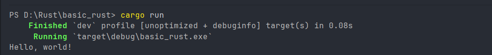
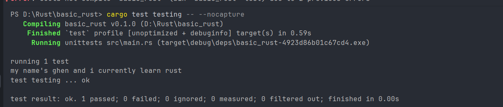
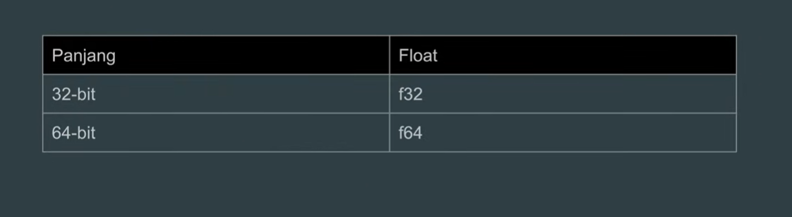
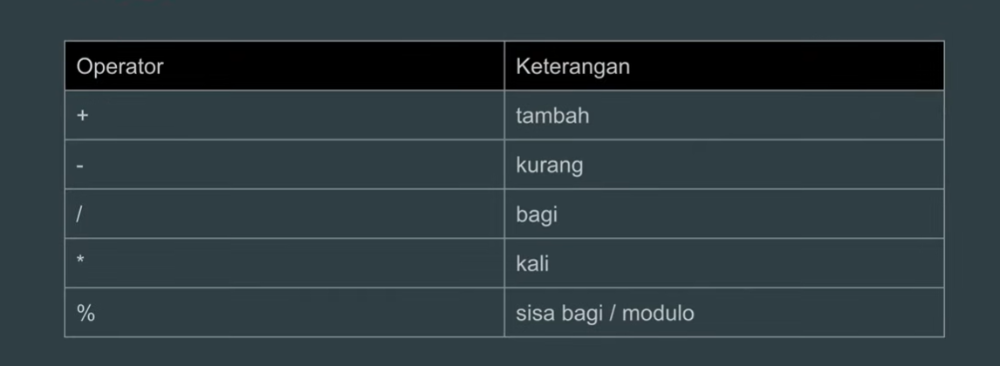
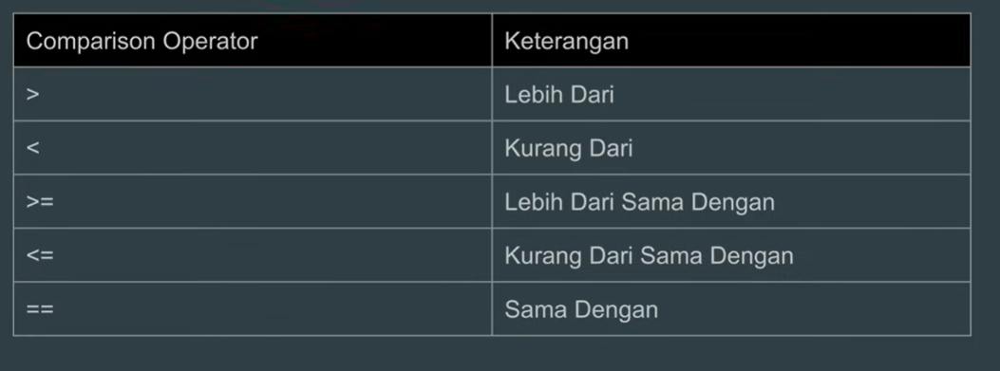
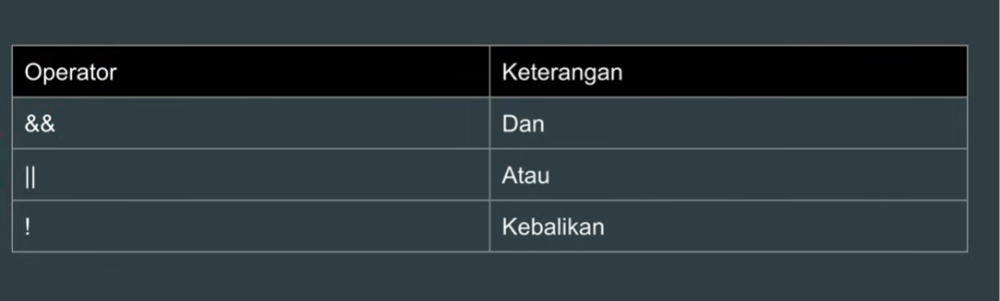

# This is my repository for learn Rust programming, written on 29 july 2026, by GhenAyari.

🇬🇧 English | [🇮🇩 Bahasa Indonesia](README.id.md)

---

## How to write "Hello world in Rust"
<br>

```

fn main(){
    println!("Hello, world!");
}

```
above is how to write hello world in rust and how to run it, can type "cargo run" and below the result



---

## a brief introduction to cargo in rust
Cargo is package manager default and build system in Rust.<br>
example of use cargo below: <br>
1. for make a new project in rust, we can write 

```

cargo new name_file

```
cargo will make with project structure below

belajar_rust/<br>
├── Cargo.toml<br>
└── src/<br>
└── main.rs

2. can run program as shown below

```
cargo run
```

3. Running test

```
cargo test
```

4. if wanna measure performance or release an application

```
cargo build --release
```
or

```
cargo run --release
```

Most rust programmer i think, spend 90% of their time using cargo run, then switch to
cargo build --release once the application is ready for development 
or performance testing

---
## Unit test
In Rust one project only can use one main function. i gonna use alternative methods is that "unit test"
<br>
a unit test is a code specifically dedicated to testing.

```
#[test]
fn testing(){
    println!(my name's ghen and i currently learn rust);
}
```

this is output, we can run with "cargo test name_test_function -- --exact" or can also "cargo test name_test_funciton -- --nocapture"
<br> but, first step jus run all unit test and won't show the output. so i often use second step



---

## Variable
A variable is used to store data values, to create or declare a variable in rust, we can use "let" keyword.
examples of its usage is shown below:

```
#[test]
fn variable(){
    let my_name = "Ghendida";
    println!("Hallo {} ", my_name);
}
```
and the output:

```
PS D:\Rust\basic_rust> cargo test variable -- --nocapture
   Compiling basic_rust v0.1.0 (D:\Rust\basic_rust)
    Finished `test` profile [unoptimized + debuginfo] target(s) in 0.48s                                                                                                           
     Running unittests src\main.rs (target\debug\deps\basic_rust-4923d86b01c67cd4.exe)

running 1 test
Hallo Ghendida 
test variable ... ok
```

---
<b>In Rust, we cannot change a variable that has already been assigned, which is usually called immutable. However, 
Rust allows us to create variables that can be changed, known as mutable, and the keyword is let mut. </b>

<br>
examples for mutable variable is showns below

```
#[test]
fn variable_mutable(){
    let mut age_in_2025: i8 = 18;
    println!("my age in 2025 is {} ", age_in_2025);

    age_in_2025 = 19;
    println!("my age in 2026 is {} ", age_in_2025);
}
```

and the output:

```
PS D:\Rust\basic_rust> cargo test variable_mutable -- --nocapture
Compiling basic_rust v0.1.0 (D:\Rust\basic_rust)
Finished `test` profile [unoptimized + debuginfo] target(s) in 0.49s                                                                                                           
Running unittests src\main.rs (target\debug\deps\basic_rust-4923d86b01c67cd4.exe)

running 1 test
my age in 2025 is 18
my age in 2026 is 19
test variable_mutable ... ok
```

---

Rust is a statically typed language, meaning every time you create a variable with a specific data type, 
its type can't be changed to another. 
Unlike JavaScript and PHP, this is not possible for example, changing from a string to an integer will not work in Rust

<br>
example for can't change data type

```
#[test]
fn static_type(){
    let mut my_github = "GhenAyari";
    println!("My github is {}", my_github);

    my_github = 1;
    println!("My github is {}", my_github);
}
```
 
and the output will be

```

PS D:\Rust\basic_rust> cargo test static_type -- --nocapture
   Compiling basic_rust v0.1.0 (D:\Rust\basic_rust)
error[E0308]: mismatched types                                                                                                                                                     
  --> src\main.rs:30:17
   |
27 |     let mut my_github = "GhenAyari";
   |                         ----------- expected due to this value
...
30 |     my_github = 1;
   |                 ^ expected `&str`, found integer

For more information about this error, try `rustc --explain E0308`.                                                                                                                
error: could not compile `basic_rust` (bin "basic_rust" test) due to 1 previous error  

```

---

In Rust, we can create variables with the same name, but when we do, the previous variable will be covered, 
or what is called shadowing. this practice is not ideal, but it is still allowed in Rust

<br>
example for shadowing

```
#[test]
fn shadowing(){
    let name = "Ghendida";
    println!("Hallo {} ", name);

    let name = 10;
    println!("it's the {}th now ", name);

    let name = 2026;
    println!("this is {} year ", name);
}
```

and output will be

```
PS D:\Rust\basic_rust> cargo test shadowing -- --nocapture
   Compiling basic_rust v0.1.0 (D:\Rust\basic_rust)
    Finished `test` profile [unoptimized + debuginfo] target(s) in 0.52s                                                                                                           
     Running unittests src\main.rs (target\debug\deps\basic_rust-4923d86b01c67cd4.exe)

running 1 test
Hallo Ghendida 
it's the 10th now 
this is 2026 year 
test shadowing ... ok

```

As seen above, if we create a variable with the same name but a different value and type, 
the previous variable will be shadowed and become inaccessible


---
Every variable in Rust has a data type, grouped into two types: scalar and compound. a scalar type represents a single value, for example: strings, integers, floats, 
booleans, and chars. meanwhile, compound types represent multiple values, which are tuples and arrays
<br>
In Rust, when creating a variable, there is no need to mention the data type explicitly because Rust will 
automatically recognize the data type used. However, it is still possible if you want to mention the data type explicitly when creating a variable with the colon (:) keyword
<br>

example an explicit variable
```
#[test]
fn explicit_variable(){
    let age: i8 = 19;
    println!("My age is {} ", age);

    let weight: f32 = 51.5;
    println!("my body weight is {} ", weight);
}
```

output:

```
PS D:\Rust\basic_rust> cargo test explicit_variable -- --nocapture
   Compiling basic_rust v0.1.0 (D:\Rust\basic_rust)
    Finished `test` profile [unoptimized + debuginfo] target(s) in 0.48s                                                                                                           
     Running unittests src\main.rs (target\debug\deps\basic_rust-4923d86b01c67cd4.exe)

running 1 test
My age is 19 
my body weight is 51.5 
test explicit_variable ... ok
```

---

Here's integer and float type




If you make a variable implicitly or dont mention the data type, 
Rust will automatically give i32 for integers and f64 for decimals

---

Type data conversion

Rust can perform data type conversions from smaller to larger types, and vice versa. However, there is something to keep in mind: converting a larger type to a smaller one can cause an integer overflow. 
For example, trying to convert the value 100,000 from an i32 to an i8 will trigger an integer overflow
<br>

first, example from smaller to larger types

```
#[test]
fn conversion(){
    let a: i8 = 19;
    println!("my number {} ", a);

    let b: i16 = a as i16;
    println!("his number is {} ", b);

    let c : i32 = a as i32;
    println!("my number {} ", c); 
}
```

the output will be

```
PS D:\Rust\basic_rust> cargo test conversion -- --nocapture       
   Compiling basic_rust v0.1.0 (D:\Rust\basic_rust)
    Finished `test` profile [unoptimized + debuginfo] target(s) in 0.51s                                                                                                           
     Running unittests src\main.rs (target\debug\deps\basic_rust-4923d86b01c67cd4.exe)

running 1 test
my number 19 
his number is 19 
my number 19 
test conversion ... ok

test result: ok. 1 passed; 0 failed; 0 ignored; 0 measured; 5 filtered out; finished in 0.00s
```

---

and an example for large to small

```
#[test]
fn conversion_to_large(){
    let a: i64 = 1000000;
    println!("number {} ", a);

    let b: i8 = a as i8;
    println!("number {} ", b);

}
```

the output

```
PS D:\Rust\basic_rust> cargo test conversion_to_large -- --nocapture
   Compiling basic_rust v0.1.0 (D:\Rust\basic_rust)
    Finished `test` profile [unoptimized + debuginfo] target(s) in 0.42s                                                                                                           
     Running unittests src\main.rs (target\debug\deps\basic_rust-4923d86b01c67cd4.exe)

running 1 test
number 1000000 
number 64 
test conversion_to_large ... ok
```

--- 

## Operators

Operators numeric



below for example operators numeric use case studies trapezoid area formula

```
#[test]
fn operators_numeric(){

    let height = 3.0;

    let a = 5.0;

    let b = 8.0;

    let l = 0.5;

    let result = l * (a + b) * height;

    println!("result = {}, ({} + {}), X {}, = {} ", l, a, b, height, result);

}
```

and the result is:

```
PS D:\Rust\basic_rust> cargo test operators_numeric -- --nocapture
   Compiling basic_rust v0.1.0 (D:\Rust\basic_rust)
    Finished `test` profile [unoptimized + debuginfo] target(s) in 0.50s                                                                                                           
     Running unittests src\main.rs (target\debug\deps\basic_rust-4923d86b01c67cd4.exe)

running 1 test
result = 0.5, (5 + 8), X 3, = 19.5 
test operators_numeric ... ok
```

--- 

comparison operators<br>

Comparison operators are special symbols in programming used to compare two values or expressions to determine the relationship between them. The result of a comparison operation is 
always a boolean value—either True or False—which is commonly used in decision-making structures like if statements or loops



example for comparison operators

```
#[test]
fn comparison_operators(){

    let a = 15 > 10;
    let b = 10 >= 10;
    let c = 15 < 10;
    let d = 10 == 10;

    println!("is the number 15 than 10? = {}", a);
    println!("is the number 10 than same as 10? = {}", b);
    println!("is the number 15 less than 10? = {}", c);
    println!("is the number 10 same as 10? = {}", d);

}
```

and the output:

```
PS D:\Rust\basic_rust> cargo test comparison_operators -- --nocapture
   Compiling basic_rust v0.1.0 (D:\Rust\basic_rust)
    Finished `test` profile [unoptimized + debuginfo] target(s) in 0.57s                                                                                                           
     Running unittests src\main.rs (target\debug\deps\basic_rust-4923d86b01c67cd4.exe)

running 1 test
is the number 15 than 10? = true
is the number 10 than same as 10? = true
is the number 15 less than 10? = false
is the number 10 same as 10? = true
test comparison_operators ... ok
```

---

boolean operators

Operator boolean adalah operator logika yang digunakan untuk membandingkan nilai atau mengevaluasi ekspresi, menghasilkan nilai akhir berupa benar (true) atau salah (false).
Operator ini berfungsi sebagai dasar pengendalian alur program dan penyaringan informasi dalam berbagai sistem digital




an example for boolean operators

```
#[test]
fn boolean_operators(){

    let age = 20;
    let height = 170;

    let category = 18 <= age;
    let height = 165 <= height;

    let result = category && height;

    println!("is he an adult man? {}", result);

}
```

and the output: 

```
PS D:\Rust\basic_rust> cargo test boolean_operators -- --nocapture
   Compiling basic_rust v0.1.0 (D:\Rust\basic_rust)
    Finished `test` profile [unoptimized + debuginfo] target(s) in 0.55s                                                                                                           
     Running unittests src\main.rs (target\debug\deps\basic_rust-4923d86b01c67cd4.exe)

running 1 test
is he an adult man? true
test boolean_operators ... ok
```

---

## Compound data type

Tuple,A tuple is a data type that groups together a collection of data types. 
The number of elements in a tuple is final and can't be modified, decreased, or increased. to create a tuple,can use parentheses ()

an example for tuple

```
#[test]
fn tuple(){
    let a: (i32, f64, &str) = (500, 6.4, "Hello");

    println!("Here is tuple = {:?} ", a);

    let tuple1 = a.0;
    let tuple2 = a.1;
    let tuple3 = a.2;

    println!("{}, {}, {} ", tuple1, tuple2, tuple3);

    // or we can also do Destructing tuple
    let (a, b, _) = a; // use _ if don't wanna ose one of them
    println!("Use desctructing tuple = {}, {}",a, b );
}
```

and the output:

```
S D:\Rust\basic_rust> cargo test tuple -- --nocapture
   Compiling basic_rust v0.1.0 (D:\Rust\basic_rust)
    Finished `test` profile [unoptimized + debuginfo] target(s) in 0.52s                                                                                                           
     Running unittests src\main.rs (target\debug\deps\basic_rust-4923d86b01c67cd4.exe)

running 1 test
Here is tuple = (500, 6.4, "Hello") 
500, 6.4, Hello 
500, 6.4
test tuple ... ok
```

--- 

Mutable Tuple<br>
Technically, we can still modify the contents of a tuple by making it a mutable tuple. You just need to add the mut keyword

an example for mutable tuple 

```
#[test]
fn mutable_tuple(){
    let mut about_me: (&str, i8, &str) = ("Ghen", 19, "Mulawarman University");

    let (a, b, c) = about_me;

    println!("{}, {}, {}", a, b, c);

    about_me.0 = "Ghendida";
    about_me.1 = 20;
    about_me.2 = "From mulawarman university";

    println!("{:?}", about_me);

}
```

```
PS D:\Rust\basic_rust> cargo test mutable_tuple -- --nocapture 
   Compiling basic_rust v0.1.0 (D:\Rust\basic_rust)
    Finished `test` profile [unoptimized + debuginfo] target(s) in 0.48s                                                                                                           
     Running unittests src\main.rs (target\debug\deps\basic_rust-4923d86b01c67cd4.exe)

running 1 test
Ghen, 19, Mulawarman University
("Ghendida", 20, "From mulawarman university")
test mutable_tuple ... ok
```

--- 
Array <br>

An array is a data type that contains a collection of data just like a tuple. The difference is in an 
array you can only use one data type, different from a tuple which can use many data types. To make an array, use []

example code below:

```
#[test]
fn array(){

    let array_list: [i8; 3] = [10, 20, 30];
    println!("here are some array = {:?}", array_list);

    let a = array_list[0];
    let b = array_list[1];
    let c = array_list[2];

    println!("{}, {}, {}", a, b, c);


}
```

the output result below:

```
PS D:\Rust\basic_rust> cargo test array -- --nocapture
   Compiling basic_rust v0.1.0 (D:\Rust\basic_rust)
    Finished `test` profile [unoptimized + debuginfo] target(s) in 0.58s                                                                                                           
     Running unittests src\main.rs (target\debug\deps\basic_rust-4923d86b01c67cd4.exe)

running 1 test
here are some array = [10, 20, 30]
10, 20, 30
test array ... ok
```

--- 
Mutable Array<br>
we can change contain of array with use "mut".

example code below

```
#[test]
fn mutable_array(){

    let mut array_can_change: [&str; 3] = ["Ramli", "Ruger", "Razi"];

    println!("{:?}", array_can_change);

    array_can_change[0] = "Rizal";
    array_can_change[1] = "Raditya";
    array_can_change[2] = "Roslan";

    println!("{}, {}, {}" , array_can_change[0], array_can_change[1], array_can_change[2]);

}
```

the output result below

```
PS D:\Rust\basic_rust> cargo test mutable_array -- --nocapture
   Compiling basic_rust v0.1.0 (D:\Rust\basic_rust)
    Finished `test` profile [unoptimized + debuginfo] target(s) in 0.59s                                                                                                           
     Running unittests src\main.rs (target\debug\deps\basic_rust-4923d86b01c67cd4.exe)

running 1 test
["Ramli", "Ruger", "Razi"]
Rizal, Raditya, Roslan
test mutable_array ... ok
```

--- 
two demonsional array <br>
we can create an array inside an array, which is commonly referred to as a two-dimensional array

example code below

```
#[test]
fn two_dimensional_arrays(){

    let array: [[i32; 3];3] = [
        [13, 16, 6],
        [10, 08, 09],
        [10, 06, 30]

    ];

    println!("{:?}", array);

    println!("{}", array[1][1]);
    println!("{}", array[0][1]);
    println!("{}", array[0][0]);

}
```

and the output result below

```
PS D:\Rust\basic_rust> cargo test two_dimensional_array -- --nocapture
   Compiling basic_rust v0.1.0 (D:\Rust\basic_rust)
    Finished `test` profile [unoptimized + debuginfo] target(s) in 0.45s                                                                                                           
     Running unittests src\main.rs (target\debug\deps\basic_rust-4923d86b01c67cd4.exe)

running 1 test
[[13, 16, 6], [10, 8, 9], [10, 6, 30]]
8
16
13
test two_dimensional_arrays ... ok
```

--- 
## Constant

A constant is an immutable variable that uses the const keyword. The difference 
between const and let is that constants cannot be made mutable, and you must explicitly state the data type when creating a constant

example code below

```
const MAXIMUM: i16 = 37;
#[test]
fn const_variable() {
    const MINIMUM: i16 = 33;
    println!("Use constant variable {}", MINIMUM);

    println!("We can use variable out of scope {}", MAXIMUM);


}
```

an output will be bellow

```
PS D:\Rust\basic_rust> cargo test const_variable -- --nocapture       
   Compiling basic_rust v0.1.0 (D:\Rust\basic_rust)
    Finished `test` profile [unoptimized + debuginfo] target(s) in 0.52s                                                                                                           
     Running unittests src\main.rs (target\debug\deps\basic_rust-4923d86b01c67cd4.exe)

running 1 test
Use constant variable 33
We can use variable out of scope 37
test const_variable ... ok
```

---

## Scope 
Variable scope defines the area where a variable can be used. A variable can 
be used inside the scope where the variable is located and in the inner scope, but it can't be used in the outer scope

example code below 

```
const UNIV_NAME: &str = "Mulawarman University"; // This variable can be used because it is located in the outermost scope so any function can access it
#[test]
fn scope() {
    // variable name can't used in here
    let name = "Ghendida"; // variable name can used start here
    println!("he's name is {}", name);

    { // inner scope
        println!("he's name middle name is Gantari and first name {}", name);
        let age: i8 = 19;
        println!("he's {} years old and from {} ", age, UNIV_NAME);
    }

    // println!("{}", age); // error bc in outer scope
}
```

the output below

```
PS D:\Rust\basic_rust> cargo test scope -- --nocapture
   Compiling basic_rust v0.1.0 (D:\Rust\basic_rust)
    Finished `test` profile [unoptimized + debuginfo] target(s) in 0.57s                                                                                                           
     Running unittests src\main.rs (target\debug\deps\basic_rust-4923d86b01c67cd4.exe)

running 1 test
he's name is Ghendida
he's name middle name is Gantari and first name Ghendida
he's 19 years old and from Mulawarman University 
test scope ... ok
```

--- 

## Management Memory 

Memory management is how a programming language manages memory (RAM) usage while a program is running. Every time a program creates data, the computer must allocate space in memory to store it. When that data is no longer needed, the memory space must be freed
so it can be reused by other data. The main challenge is determining when memory should be released and who is responsible for doing so<br>

In languages like C, the programmer is fully responsible for memory management. Programmers must manually request memory when needed and return it once they are finished. This approach offers immense control and high performance, but it is also highly error-prone. If a programmer forgets to free the memory, a 
memory leak occurs. If memory is freed more than once or used after being released, the program can crash or exhibit undefined behavior<br>

Languages like Java, Kotlin, Python, JavaScript, and Go take a different approach. They use a Garbage Collector, which is a system that automatically finds and cleans up memory that is no longer in use. This approach makes development easier because programmers don't have to worry about when to free memory. However, this cleanup process requires extra resources and can sometimes cause performance drops or brief pauses while the program is running.

Rust attempts to combine the strengths of both approaches. It does not force the programmer to manage memory manually like C, nor does it use a Garbage Collector like Java or Python. Instead, Rust utilizes a system of ownership, borrowing, and lifetimes to ensure every piece of data has clear ownership rules. The Rust compiler checks these rules during compilation. 
If there is any potential memory management error, the program will not compile until the issue is resolved<br>

As a result, Rust can manage memory automatically without needing a Garbage Collector at runtime. Many errors that are typically only caught during runtime in other languages can be detected early by the Rust compiler. This is why Rust is often described as a language that
offers a combination of high performance like C/C++ and better memory safety than many other systems programming languages<br>

To summarize in a single sentence: C and C++ entrust memory management to the programmer, 
Java and Python entrust it to the Garbage Collector, while Rust entrusts it to the compiler through the ownership system

When a Rust program runs, it stores data in RAM (Random Access Memory).
<br>

Most data is stored in one of two places:

```text
RAM
├── Stack
└── Heap
```

Understanding Stack and Heap is important because Rust's Ownership system was designed around them.

---

### Stack

The Stack is a fast and organized memory region.

Think of it like a stack of plates:

```text
Top
┌─────┐
│  3  │
├─────┤
│  2  │
├─────┤
│  1  │
└─────┘
Bottom
```

You can only add or remove items from the top.

Because of this structure:

- Very fast
- Automatically managed
- Predictable memory access

#### Common Stack Data

- Integers (`i32`, `u64`)
- Floats (`f32`, `f64`)
- Booleans (`bool`)
- Characters (`char`)
- Fixed-size arrays

---

### Heap

The Heap is a larger and more flexible memory region.

Think of it like a warehouse:

```text
┌─────────┐
│ Box A   │
├─────────┤
│ Box B   │
├─────────┤
│ Box C   │
└─────────┘
```

Unlike the Stack, the operating system must search for available space before storing data.

Because of this:

- More flexible
- Can store dynamic data
- Slower than Stack

### Common Heap Data

- String
- Vec<T>
- HashMap<K, V>
- Dynamic collections

---

### Stack vs Heap

| Feature | Stack | Heap |
|----------|----------|----------|
| Speed | Very Fast | Slower |
| Allocation | Automatic | Dynamic |
| Memory Size | Smaller | Larger |
| Structure | Ordered | Flexible |
| Access Cost | Low | Higher |
| Common Data | Numbers, Booleans | Strings, Vectors |

---

#### How String Uses Stack and Heap

A Rust String uses both memory regions.

```text
Stack
┌──────────┐
│ Pointer  │ ─────────────┐
│ Length   │              │
│ Capacity │              │
└──────────┘              │
                          ▼
Heap
┌─────────────────────┐
│ G | h | e | n       │
└─────────────────────┘
```

#### Stack Stores

- Pointer
- Length
- Capacity

#### Heap Stores

- Actual text data

For example:

```text
"Ghen"
```

The characters themselves live on the Heap.

---

### Why Ownership Exists

Heap memory is powerful but dangerous.

Without proper management, programs may suffer from:

- Memory Leaks
- Double Free Errors
- Dangling Pointers
- Undefined Behavior

Rust prevents these issues using:

- Ownership
- Borrowing
- Lifetimes

The Rust compiler checks these rules before the program runs.

---

### Memory Management Comparison

| Language | Memory Management |
|-----------|------------------|
| C | Manual |
| C++ | Mostly Manual |
| Java | Garbage Collector |
| Kotlin | Garbage Collector |
| Python | Garbage Collector + Reference Counting |
| JavaScript | Garbage Collector |
| Go | Garbage Collector |
| Rust | Ownership System |

Rust is unique because it provides memory safety without requiring a Garbage Collector.

example code below

```
#[test]
fn memory_management() {

    // When function_a() is called,
    // Rust creates a stack frame for function_a
    function_a();

    // After function_a() finishes,
    // its stack frame is removed

    // Then Rust creates a new stack frame
    // for function_b
    function_b();
}

fn function_a(){

    // age is an i32
    // its size is fixed (4 bytes)
    // stored directly on the STACK
    let age = 19;

    // The variable year_of_birth itself is stored on the STACK
    //
    // However, the actual String data ("2006")
    // is stored on the HEAP
    //
    // Stack:
    // Pointer
    // Length
    // Capacity
    //
    // Heap:
    // "2" "0" "0" "6"
    let year_of_birth: String = String::from("2006");

    // year is an i32
    // the result of parsing the String
    // stored on the STACK
    let year: i32 = year_of_birth.parse().unwrap();

    println!(
        "Ghen is {} years old and born in {}",
        age,
        year
    );

    // function_a finishes here

    // age and year are removed from the STACK

    // year_of_birth is also removed from the STACK

    // Before it is removed,
    // Rust automatically frees
    // the "2006" data stored on the HEAP
}

fn function_b(){

    // The variable name is stored on the STACK
    //
    // The actual String data "Ghendida"
    // is stored on the HEAP
    let name: String = String::from("Ghendida");

    // i32 value
    // stored on the STACK
    let entry_year = 2024;

    println!(
        "my name is {} and i entered this university in {}",
        name,
        entry_year
    );

    // function_b finishes here

    // entry_year is removed from the STACK

    // name is removed from the STACK

    // The "Ghendida" data stored on the HEAP
    // is automatically cleaned up by Rust
}
```

### Memory Layout During `function_a()`

When `function_a()` is running, the stack contains the local variables `age`, `year`, and the metadata of `year_of_birth`.

The actual string data `"2006"` is stored on the heap.

```text
STACK
┌─────────────────────┐
│ age = 19            │
├─────────────────────┤
│ year = 2006         │
├─────────────────────┤
│ year_of_birth       │
│ Pointer ───────────────┐
│ Length = 4         │   │
│ Capacity = 4       │   │
└─────────────────────┘   │
                          ▼
HEAP
┌─────────────────────┐
│ 2 │ 0 │ 0 │ 6       │
└─────────────────────┘
```

---

### after `function_a()` finishes

When the function scope ends:

- `age` is removed from the stack.
- `year` is removed from the stack.
- `year_of_birth` is dropped.
- The heap memory containing `"2006"` is automatically freed by Rust.

```text
STACK
┌─────────────────────┐
│ (empty)             │
└─────────────────────┘

HEAP
┌─────────────────────┐
│ "2006" freed        │
└─────────────────────┘
```

---

### memory layout during `function_b()`

When `function_b()` is running:

- `entry_year` is stored directly on the stack.
- `name` stores String metadata on the stack.
- The actual text `"Ghendida"` is stored on the heap.

```text
STACK
┌─────────────────────┐
│ entry_year = 2024   │
├─────────────────────┤
│ name                │
│ Pointer ───────────────┐
│ Length = 8         │   │
│ Capacity = 8       │   │
└─────────────────────┘   │
                          ▼
HEAP
┌─────────────────────┐
│ G h e n d i d a     │
└─────────────────────┘
```

---

### key Observation

A `String` in Rust does **not** store its text directly on the stack.

The stack only stores:

- Pointer
- Length
- Capacity

The actual text data lives on the heap.

This is why Rust's ownership system is especially important for heap-allocated data such as:

- `String`
- `Vec<T>`
- `HashMap<K, V>`

When the owner goes out of scope, Rust automatically frees the associated heap memory.

---

## &str and String

- Rust features two string types: &str (string slice), which has a fixed size, and String, which is growable<br>
- &str is fixed-size, it goes onto the stack, while String is allocated on the heap due to its dynamic size<br>

example code for &str is below

```
#[test]
fn string_slice() {

    // name is a string slice (&str)
    //
    // STACK:
    // - Pointer
    // - Length
    //
    // READ-ONLY MEMORY:
    // - "  Ghendida  "
    //
    // &str does not own the text.
    let mut name: &str = "  Ghendida  ";

    println!("{}", name);

    // trim()
    //
    // Removes leading and trailing whitespace.
    //
    // IMPORTANT:
    // trim() does NOT create a new String.
    //
    // It returns another &str that points
    // to a portion of the original text.
    //
    // STACK:
    // - New Pointer
    // - New Length
    //
    // READ-ONLY MEMORY:
    // - Still points to the same text
    //
    // No HEAP allocation occurs.
    let delete_space: &str = name.trim();

    println!("{}", delete_space);
}
```

and the output

```
PS D:\Rust\basic_rust> cargo test string_slice -- --nocapture         
   Compiling basic_rust v0.1.0 (D:\Rust\basic_rust)
    Finished `test` profile [unoptimized + debuginfo] target(s) in 0.50s                                                                                                           
     Running unittests src\main.rs (target\debug\deps\basic_rust-4923d86b01c67cd4.exe)

running 1 test
  Ghendida  
Ghendida
test string_slice ... ok
```

example code for String is below

```
#[test]
fn string_not_fixed_size() {

    let name: String = String::from("ghendida ayari");
    println!("{}\n",name.to_lowercase());

    let mut list_name: (String, String, String) = (String::new(), String::from("satrio"), String::from("Rusman"));
    println!("{:?}", list_name);

    list_name.0.push_str("Akmal");

    println!("\n{}, {}, {} ", list_name.0.to_uppercase() , list_name.1.to_uppercase(), list_name.2.replace("Rusman", "Ramli").to_uppercase());


}
```

the output will be

```
PS D:\Rust\basic_rust> cargo test string_not_fixed_size -- --nocapture
    Finished `test` profile [unoptimized + debuginfo] target(s) in 0.06s
     Running unittests src\main.rs (target\debug\deps\basic_rust-4923d86b01c67cd4.exe)

running 1 test
ghendida ayari

("", "satrio", "Rusman")

AKMAL, SATRIO, RAMLI 
test string_not_fixed_size ... ok
```

---

## understanding Ownership in Rust

A beginner-friendly guide to one of the most important concepts in Rust.

---

### Table of Contents

- [Introduction](#introduction)
- [What is Ownership?](#what-is-ownership)
- [Why Does Rust Need Ownership?](#why-does-rust-need-ownership)
- [The Three Rules of Ownership](#the-three-rules-of-ownership)
- [Ownership and Scope](#ownership-and-scope)
- [Ownership and Heap Memory](#ownership-and-heap-memory)
- [Why Ownership Makes Rust Safe](#why-ownership-makes-rust-safe)
- [Comparison with Other Languages](#comparison-with-other-languages)
- [Key Takeaways](#key-takeaways)

---

### Introduction

One of the biggest challenges in programming is managing memory safely and efficiently.

Many programming languages solve this problem in different ways:

- C uses manual memory management.
- C++ mostly uses manual memory management with additional tools.
- Java, Kotlin, Python, and JavaScript use a Garbage Collector.
- Rust uses a unique system called **Ownership**.

Ownership allows Rust to provide memory safety without requiring a Garbage Collector.

---

### What is Ownership?

Ownership is Rust's system for managing memory.

Every value in Rust has an **owner**.

The owner is responsible for the value and determines when that value should be removed from memory.

Think of ownership like owning a house.

```text
House
  ↑
Owner
```

Every house has an owner.

When ownership of the house is transferred to someone else, the previous owner no longer owns it.

Rust applies the same concept to data stored in memory.

---

### Why Does Rust Need Ownership?

Without proper memory management, programs can suffer from problems such as:

- Memory Leaks
- Double Free Errors
- Use After Free
- Dangling Pointers

These issues can cause crashes, unexpected behavior, and security vulnerabilities.

Ownership helps Rust prevent these problems at compile time before the program is executed.

---

### The Three Rules of Ownership

Rust's ownership system is built on three simple rules.

---

### Each Value Has One Owner

Every value in Rust has a variable that owns it.

```text
Data
 ↑
Owner
```

A value cannot exist without an owner.

Rust always knows who owns a piece of data.

---

### There Can Only Be One Owner at a Time

Ownership can be transferred from one variable to another.

When ownership is transferred:

```text
Old Owner ❌
      ↓
New Owner ✅
```

The previous owner loses access to the data.

This prevents multiple owners from trying to free the same memory.

---

### When the Owner Goes Out of Scope, the Value is Dropped

When the owner leaves its scope, Rust automatically cleans up the associated memory.

```text
Scope Ends
     ↓
Owner Removed
     ↓
Drop
     ↓
Memory Freed
```

This process happens automatically.

No manual cleanup is required.

---

### Ownership and Scope

Scope determines how long a variable is valid.

A variable exists only inside the block where it was created.

```text
Scope Starts
     ↓
Variable Exists
     ↓
Scope Ends
     ↓
Variable Dropped
```

When the scope ends, Rust automatically releases any resources owned by that variable.

---

### Ownership and Heap Memory

Ownership becomes especially important when working with heap-allocated data.

Examples include:

- String
- Vec<T>
- HashMap<K, V>

For example, a String stores its actual text on the heap.

```text
STACK
┌──────────────┐
│ Pointer      │──────────────┐
│ Length       │              │
│ Capacity     │              │
└──────────────┘              │
                              ▼
HEAP
┌──────────────┐
│ H e l l o    │
└──────────────┘
```

The owner is responsible for this heap memory.

When the owner is dropped, Rust automatically frees the heap allocation.

---

#### Why Ownership Makes Rust Safe

Ownership allows Rust to prevent many common memory bugs.

#### Prevents Memory Leaks

Unused memory is automatically released when the owner is dropped.

#### Prevents Double Free

Only one owner exists at a time.

Therefore, memory cannot be freed twice.

#### Prevents Use After Free

Rust ensures that data cannot be accessed after it has been dropped.

#### Improves Concurrency Safety

Ownership rules help prevent data races in multithreaded programs.

---

### Comparison with Other Languages

| Language | Memory Management |
|-----------|------------------|
| C | Manual |
| C++ | Mostly Manual |
| Java | Garbage Collector |
| Kotlin | Garbage Collector |
| Python | Garbage Collector + Reference Counting |
| JavaScript | Garbage Collector |
| Go | Garbage Collector |
| Rust | Ownership System |

Rust is unique because it provides memory safety without using a Garbage Collector.

---

### Key Takeaways

✅ Every value in Rust has an owner.

✅ A value can only have one owner at a time.

✅ When the owner goes out of scope, the value is automatically dropped.

✅ Ownership prevents many memory-related bugs.

✅ Rust achieves memory safety without a Garbage Collector.

✅ Ownership is the foundation of Rust's memory management system.

---

#### Ownership scope 

Scope is the area where a variable is valid and can be accessed. Ownership scope refers to the period during which an owner remains within that scope and retains its data. 
Once the owner goes out of scope, Rust automatically triggers the drop process and frees the memory associated with that owner

example code below 

```
#[test]
fn ownership_scope() {

    // let a variable can't access in here because out of scope and hasn't been created in this line
    let a = 10; // can access start here

    {
        let name = "ghen";
        println!("{}", name);
    } // variable name can't accesss start here because already out of scope

    println!("{}", a); // can access in here because still in scope

} // variable a can't access or ended in here bcs already out of scope
```

and output below

```
PS D:\Rust\basic_rust> cargo test ownership_scope -- --nocapture      
   Compiling basic_rust v0.1.0 (D:\Rust\basic_rust)
    Finished `test` profile [unoptimized + debuginfo] target(s) in 0.53s                                                                                                           
     Running unittests src\main.rs (target\debug\deps\basic_rust-4923d86b01c67cd4.exe)

running 1 test
ghen
10
test ownership_scope ... ok
```

---

#### Data Copy

example code below

```
#[test]
fn data_copy() {
    let a = 16;
    let b = a;

    println!("{}, {}", a, b);
    
}
```

output below

```
C:/Users/Asus/.cargo/bin/cargo.exe test --color=always --package basic_rust --bin basic_rust data_copy --profile test --no-fail-fast --config "target.x86_64-pc-windows-gnu.runner=['C:\Program Files\JetBrains\RustRover 2025.3.4\bin\native-helper\intellij-rust-native-helper.exe']" -- --format=json --exact -Z unstable-options --show-output
Testing started at 7:05 PM ...
    Finished `test` profile [unoptimized + debuginfo] target(s) in 0.00s
     Running unittests src\main.rs (target\debug\deps\basic_rust-4923d86b01c67cd4.exe)
16, 16
```

explanation

```text
STACK
┌──────────┐
│ a = 16   │
├──────────┤
│ b = 16   │
└──────────┘

HEAP
┌──────────┐
│ (empty)  │
└──────────┘
```

- `i32` is stored on the stack.
- `b = a` creates a copy of the value.
- Both `a` and `b` remain valid.
- No ownership transfer occurs.
- No heap allocation is involved.

---

#### Ownership Movement

However, "Data Copy" does not occur for data types stored on the Heap.

Following the Ownership rules, a value can only have one owner at a time.

Therefore, when we create a new variable (a new owner) from an existing variable (the old owner), the data is not copied. Instead, the ownership is transferred from the old owner to the new owner.

Once the transfer is complete, the old owner is automatically considered invalid and can no longer be used.

example code below

```
#[test]
fn ownership_movement() {

    let name: String = String::from("Ghendida");

    // ownership name has move to name_2
    let name_2 = name;
    // name variable has can't access because ownership move to name_2

    println!("{}", name_2);

}
```

and output below

```
PS D:\Rust\basic_rust> cargo test ownership_movement -- --nocapture
   Compiling basic_rust v0.1.0 (D:\Rust\basic_rust)
    Finished `test` profile [unoptimized + debuginfo] target(s) in 0.52s                                                                                                           
     Running unittests src\main.rs (target\debug\deps\basic_rust-4923d86b01c67cd4.exe)

running 1 test
Ghendida
test ownership_movement ... ok
```

---

#### Clone

Now we know that data on the Stack will be copied, while data on the Heap will have its ownership moved.

So, what if we also want to copy data that is stored on the Heap?

To do that, we must use "Clone".

Cloning means creating an exact duplicate of the original data.

String has a .clone() method specifically for this purpose.

When we call the .clone() method, it will copy the String data into a completely new String.

In Rust, almost all data types stored on the Heap implement the .clone() method

example code is below

```
#[test]
fn clone() {

    let name: String = String::from("Ghendida");

    let name2 = name.clone();

    println!("{}, {}", name, name2); // This is known as a clone.
    // If the string data is 10 MB, Rust will perform a clone of the same size, which is 10 MB

}
```

and the output

```
PS D:\Rust\basic_rust> cargo test clone -- --nocapture             
   Compiling basic_rust v0.1.0 (D:\Rust\basic_rust)
    Finished `test` profile [unoptimized + debuginfo] target(s) in 0.48s                                                                                                           
     Running unittests src\main.rs (target\debug\deps\basic_rust-4923d86b01c67cd4.exe)

running 1 test
Ghendida, Ghendida
test clone ... ok
```

## If Expression

Rust also has if expressions. An if expression is used to branch your code depending on conditions. 
If the condition is met, the if code block will be executed, but if it is not met, it will not be executed

example code below

```
#[test]
fn if_expression() {

    let a = 8;

    if a >= 9 {
        println!("Cool!");
    } else if a >= 8 {
        println!("Not bad")
    } else if a >= 5 {
        println!("is bad")
    } else {
        println!("shit")
    }

}
```

and the output

```
PS D:\Rust\basic_rust> cargo test if_expression -- --nocapture
   Compiling basic_rust v0.1.0 (D:\Rust\basic_rust)
    Finished `test` profile [unoptimized + debuginfo] target(s) in 0.55s                                                                                                           
     Running unittests src\main.rs (target\debug\deps\basic_rust-4923d86b01c67cd4.exe)

running 1 test
Not bad
test if_expression ... ok

```

---

## Let Statement

In Rust, if is an expression, meaning it can return a value and can be used with a let statement to 
assign data to a variable. This is very useful because we don't need to separate the variable declaration from assigning its value

example code below

```
#[test]
fn let_statement () {

    let value = 80;
    let result: &str;

    if value >= 80{
        result = "Good";
    } else if value >= 70 {
        result = "Not Bad";
    } else if value >= 60 {
        result = "Bad";
    } else {
        result = "Shit";
    }

    println!("{}", result);

}
```

and output is below

```
PS D:\Rust\basic_rust> cargo test let_statement -- --nocapture
   Compiling basic_rust v0.1.0 (D:\Rust\basic_rust)
    Finished `test` profile [unoptimized + debuginfo] target(s) in 0.54s                                                                                                           
     Running unittests src\main.rs (target\debug\deps\basic_rust-4923d86b01c67cd4.exe)

running 1 test
Good
test let_statement ... ok
```

--- 

## Loop

In Rust, the `loop` keyword is used to create an **infinite loop**. Unlike `while` or `for`, a `loop` does not have a built-in exit condition at the start; it will execute the block of code repeatedly forever until it is explicitly told to stop.

### Key Concepts

*   **`break`**: Acts as an emergency stop. It immediately terminates the loop and exits the block.
*   **`continue`**: Skips the remaining code in the current iteration and immediately jumps back to the top of the loop for the next turn.
*   **Loop as an Expression**: In Rust, a `loop` can return a value. You can pass a value directly after the `break` keyword, which can then be assigned to a variable using a `let` statement.

### Code Example

```
#[test]
fn loop_expression() {
    let mut counter = 0; // dimulai dari 0

    loop{
        counter += 1; // anggka akan ditambah 1 terus menerus

        if counter == 11 { // jika counternya sudah mencapai 11
            break; // hentikan
        } else if counter % 2 == 1 { // jika counter dimodulus 2 hasilnya 1 maka buang atau tidak perlu tampilkan
            continue; // continue akan mengabaikan atau skip dan langsung ke perulangan berikutnya
        }

        println!("Counter: {}", counter);
    }
}
```

and output is below

```
/home/ghen/.cargo/bin/cargo test --color=always --package basic_rust --bin basic_rust --profile test --no-fail-fast --config target.x86_64-unknown-linux-gnu.runner=['/home/ghen/.local/share/JetBrains/Toolbox/apps/rustrover/bin/native-helper/intellij-rust-native-helper'] -- loop_expression --format=json --exact -Z unstable-options --show-output
Testing started at 7:11 PM ...
    Finished `test` profile [unoptimized + debuginfo] target(s) in 0.03s
     Running unittests src/main.rs (target/debug/deps/basic_rust-bf48ffa96a14829d)
Counter: 2
Counter: 4
Counter: 6
Counter: 8
Counter: 10
```

another example

```
#[test]
fn loop_return_value() {
    let mut counter = 0; // angkanya adalah  0

    let result = loop {
        counter += 1; // perulangan akan dilakukan dan akan ditambah 1 terus
        if counter >= 10 { // jika lebih dari sama dengan 10
            break counter * 3; //break atau hentikan lalu dikali 3. jadi 3x10
        }
    };
    println!("{}", result); // memanggil perulangan

}
```

the output

```
#[test]
fn loop_return_value() {
    let mut counter = 0; // angkanya adalah  0

    let result = loop {
        counter += 1; // perulangan akan dilakukan dan akan ditambah 1 terus
        if counter >= 10 { // jika lebih dari sama dengan 10
            break counter * 3; //break atau hentikan lalu dikali 3. jadi 3x10
        }
    };
    println!("{}", result); // memanggil perulangan

}
```

--- 
### Loop Label

This section demonstrates how to use nested loops (a loop inside another loop) and **Loop Labels** (`'label:`) in Rust to create a multiplication table.

Code Structure

```
#[test]
fn loop_label() {
    let mut number = 1; // Left-hand side multiplier (Outer Variable)

    'luar: loop {
        let mut i = 1; // Right-hand side multiplier (Inner Variable)

        loop {
            if number >= 10 {
                break 'luar; // Terminate the ENTIRE nested loop structure
            }
            
            println!("{} X {} = {}", number, i, number * i);
            i += 1;
            
            if i > 10 {
                break; // Terminate only the INNER loop
            }
        }

        number += 1; // Incremented only after the inner loop finishes 10 cycles
    }
}
```

and output below

```
/home/ghen/.cargo/bin/cargo test --color=always --package basic_rust --bin basic_rust --profile test --no-fail-fast --config target.x86_64-unknown-linux-gnu.runner=['/home/ghen/.local/share/JetBrains/Toolbox/apps/rustrover/bin/native-helper/intellij-rust-native-helper'] -- loop_label --format=json --exact -Z unstable-options --show-output
Testing started at 3:17 PM ...
    Finished `test` profile [unoptimized + debuginfo] target(s) in 0.03s
     Running unittests src/main.rs (target/debug/deps/basic_rust-bf48ffa96a14829d)
1 X 1 = 1
1 X 2 = 2
1 X 3 = 3
1 X 4 = 4
1 X 5 = 5
1 X 6 = 6
1 X 7 = 7
1 X 8 = 8
1 X 9 = 9
1 X 10 = 10
2 X 1 = 2
2 X 2 = 4
2 X 3 = 6
2 X 4 = 8
2 X 5 = 10
2 X 6 = 12
2 X 7 = 14
2 X 8 = 16
2 X 9 = 18
2 X 10 = 20
3 X 1 = 3
3 X 2 = 6
3 X 3 = 9
3 X 4 = 12
3 X 5 = 15
3 X 6 = 18
3 X 7 = 21
3 X 8 = 24
3 X 9 = 27
3 X 10 = 30
4 X 1 = 4
4 X 2 = 8
4 X 3 = 12
4 X 4 = 16
4 X 5 = 20
4 X 6 = 24
4 X 7 = 28
4 X 8 = 32
4 X 9 = 36
4 X 10 = 40
5 X 1 = 5
5 X 2 = 10
5 X 3 = 15
5 X 4 = 20
5 X 5 = 25
5 X 6 = 30
5 X 7 = 35
5 X 8 = 40
5 X 9 = 45
5 X 10 = 50
6 X 1 = 6
6 X 2 = 12
6 X 3 = 18
6 X 4 = 24
6 X 5 = 30
6 X 6 = 36
6 X 7 = 42
6 X 8 = 48
6 X 9 = 54
6 X 10 = 60
7 X 1 = 7
7 X 2 = 14
7 X 3 = 21
7 X 4 = 28
7 X 5 = 35
7 X 6 = 42
7 X 7 = 49
7 X 8 = 56
7 X 9 = 63
7 X 10 = 70
8 X 1 = 8
8 X 2 = 16
8 X 3 = 24
8 X 4 = 32
8 X 5 = 40
8 X 6 = 48
8 X 7 = 56
8 X 8 = 64
8 X 9 = 72
8 X 10 = 80
9 X 1 = 9
9 X 2 = 18
9 X 3 = 27
9 X 4 = 36
9 X 5 = 45
9 X 6 = 54
9 X 7 = 63
9 X 8 = 72
9 X 9 = 81
9 X 10 = 90
10 X 1 = 10
10 X 2 = 20
10 X 3 = 30
10 X 4 = 40
10 X 5 = 50
10 X 6 = 60
10 X 7 = 70
10 X 8 = 80
10 X 9 = 90
10 X 10 = 100
```

#### Visualizing the Lifecycle (How It Works)

To easily understand how the variables move under the hood, here is a step-by-step breakdown of their execution flow:

 1. Scope and Placement
* **`number` (Outer Variable)** is declared at the top-level scope. The program evaluates this line **only once**.
* **`i` (Inner Variable)** is declared within the outer loop's scope. Every single time the outer loop completes a cycle and restarts, this line is re-evaluated, resetting `i` back to `1`.

2. The Execution Timeline

| Outer Loop (`number`) | Inner Loop (`i`) | What Happens Behind the Scenes? |
| :--- | :--- | :--- |
| **`number = 1`** | `i = 1` | The inner loop starts. Prints `1 X 1 = 1`. `i` increments to 2. |
| `number = 1` | `i = 2` | Stays in the inner loop. Prints `1 X 2 = 2`. `i` increments to 3. |
| *... (cycles)* | *... (cycles)* | *Continues until `i` reaches 10 and prints `1 X 10 = 10`.* |
| `number = 1` | `i = 11` | Condition `if i > 10` triggers `break;`. The inner loop is destroyed. |
| **`number += 1` $\rightarrow$ `2`**| *Dropped* | Flow moves down, increments `number` to 2, and loops back to the top of `'luar`. |
| `number = 2` | **`i = 1`** | **`let mut i = 1;` is read again.** A brand new `i` is born at 1. |
| `number = 2` | `i = 2` | The inner loop cycles through 1 to 10 all over again for multiplication 2. |

3. The Grand Finale
This system continues until `number` hits `10`. At that exact moment, the inner loop's condition `if number >= 10` evaluates to true, triggering `break 'luar;`. This bypasses the normal flow and immediately terminates both loops simultaneously.


--- 
## While loop

Rust provides several ways to handle repetition. The two most fundamental conditional control flows are `loop` and `while`. Understanding when to use which is essential for writing clean and idiomatic Rust code.

### Summary Table

| Feature | `loop` | `while` |
| :--- | :--- | :--- |
| **Concept** | Infinite loop by default. | Conditional loop. |
| **Exit Condition** | None at the entry point. Requires manual `break` inside the block. | Evaluated at the entry point before each iteration. |
| **Use Case** | Continuous processes (e.g., servers, game loops) or dynamic breaking logic. | Iterating through collection bounds or waiting for a specific flag to change. |
| **As an Expression** | **Supported.** Can return a value via `break value;`. | **Not supported.** Always evaluates to the unit type `()`. |

---

### Detailed Mechanics

#### 1. The `loop` Keyword
A `loop` tells the compiler to re-execute a block of code forever until it explicitly hits a `break` statement. Because Rust knows a `loop` can only be exited when you decide to break, it allows you to return a value directly from it.

```rust
fn while_loop() {

    let mut number = 0; // number dimulai dari 0

    while number <= 15 { // selama number kurang dari sama degan 15 maka jalankan terus
        if number % 2 == 1 { // jika number dimodulus 1 menghasilkan 1 (agar memunculkan yang ganjil aja)
            println!("{}", number); // munculkan number
        }
        number += 1; // number akan ditambah 1 terus
    }
}

#[test]
fn while_array() {

    let arrayy: [&str; 5] = ["Ambatukam", "Rusman", "Rusdiyansah", "Marlan", "Zuki"];
    let mut index = 0;

    while index < arrayy.len() {
        println!("{} ", arrayy[index]);
        index += 1;
    }
}
```

--- 
## For

The `for` loop is the most common, secure, and idiomatic way to handle repetition in Rust. While `while` loops iterate based on a *condition*, a `for` loop iterates over a **collection** or a **range of values** with a predefined boundary.

### Key Advantages
* **Memory Safety**: Eliminates the risk of "out-of-bounds" errors when traversing arrays.
* **No Infinite Loop Trap**: You don't need to manually increment a counter (e.g., `i += 1`), preventing accidental infinite loops.

---

### Code Examples

#### 1. Iterating Over Ranges (`..` and `..=`)
Rust uses ranges to generate numbers sequentially.

```rust
#[test]
fn test_for_ranges() {
    // Exclusive Range (1 to 4): upper bound is NOT included
    for i in 1..5 {
        println!("Exclusive: {}", i); // Prints 1, 2, 3, 4
    }

    // Inclusive Range (1 to 5): upper bound IS included
    for j in 1..=5 {
        println!("Inclusive: {}", j); // Prints 1, 2, 3, 4, 5
    }
}
```

---
## Function

Functions are the core building blocks in Rust. They allow us to write reusable, organized, and modular code. This section covers everything from basic functions to recursive algorithms.

### 1. Basic Functions
A function is declared using the `fn` keyword. Here is a simple function that unpacks (destructures) a tuple and prints its values.

```rust
fn test_function() {
    let absen: (&str, i32, i8) = ("Ghen", 2006, 16);

    // Destructuring the tuple into 3 separate variables
    let (tuple1, tuple2, tuple3) = absen;
    
    println!("Name: {}", tuple1);
    println!("Birth Year: {}", tuple2);
    println!("Birth Date: {}", tuple3);
}

#[test]
fn call_test_function() {
    test_function();
}
```

### 2. Functions with Parameters
Parameters allow functions to accept input data dynamically. You must explicitly define the data type for each parameter.

```rust
// This function requires two string slice (&str) parameters
fn say_hello(first_name: &str, last_name: &str) { 
    println!("Hello {} {}!", first_name, last_name);
}

#[test]
fn call_say_hello() {
    // Calling the function by providing the exact arguments
    say_hello("Ghendida", "Aditya"); 
    say_hello("Nolan", "Alerick");
}
```

### 3. Functions with Return Values
If a function produces a result, we must declare the return type using an arrow `->`. Rust uses **Implicit Return**, meaning the last expression without a semicolon (`;`) is automatically returned.

```rust
// Calculates the factorial of 'a' using a standard for-loop
fn factorial_loop(a: i32) -> i32 { 
    // Guard clause: if 'a' is less than 1, return 0 immediately
    if a < 1 {
        return 0; 
    } 

    let mut result = 1; 
    
    // Iterates from 1 up to 'a'
    for i in 1..=a { 
       result *= i; 
    }
    
    // Implicit Return: sends the final 'result' out of the function
    result 
}

#[test]
fn call_factorial_loop() {
    // We must store the returned value in a variable to use it
    let hasil = factorial_loop(3); 
    println!("Result: {}", hasil); // Output: 6
}
```

### 4. Recursive Functions
A recursive function is a function that calls itself to solve smaller instances of the same problem. It must have a **Base Case** (a stopping condition) to prevent infinite loops (Stack Overflow).

**Example A: Recursion with Return Value (Math)**
```rust
fn factorial_recursive(a: i32) -> i32 { 
    // 1. BASE CASE: Stops recursion when 'a' reaches 1 or less
    if a <= 1 { 
        return 1; 
    }
    
    // 2. RECURSIVE STEP: Multiplies 'a' by the result of the function with 'a - 1'
    // E.g., for a = 3, it stacks: 3 * (2 * (1)) = 6
    a * factorial_recursive(a - 1) 
}

#[test]
fn call_factorial_recursive() {
    let hasil = factorial_recursive(3);
    println!("Recursive Result: {}", hasil);
}
```

**Example B: Recursion without Return Value (Action)**
```rust
// Prints a name multiple times using recursion instead of a loop
fn function_recursive(name: String, times: u32) { 
    // Base Case: Stop when times hit 0
    if times == 0 {
        return;
    } else {
        println!("{}", name);
    }
    
    // Call itself, reducing the 'times' counter by 1
    function_recursive(name, times - 1);
}

#[test]
fn call_function_recursive() {
    function_recursive(String::from("Baskoro"), 3);
}
```